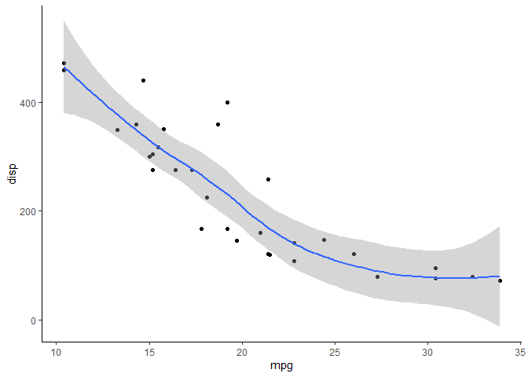
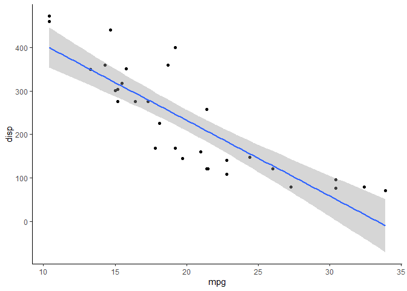
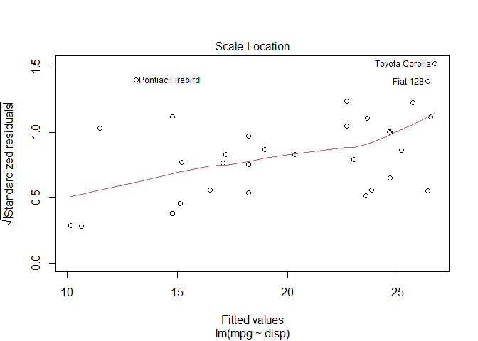

# Regresi  

Load Library
============

``` r
library(ggplot2)
library(olsrr)
library(knitr)
```

Materi
======

**Acuan Materi**

1.  [Simple Linear Regression in
    R](http://www.sthda.com/english/articles/40-regression-analysis/167-simple-linear-regression-in-r/)
2.  [Multiple Linear Regression in
    R](http://www.sthda.com/english/articles/40-regression-analysis/168-multiple-linear-regression-in-r/)
3.  [Linear Regression Assumptions and Diagnostics in
    R](https://rpubs.com/aryn999/LinearRegressionAssumptionsAndDiagnosticsInR)

Regresi linear adalah sebuah pendekatan untuk memodelkan hubungan antara
variable terikat Y dan satu atau lebih variable bebas yang disebut X.
Salah satu kegunaan dari regresi linear adalah untuk melakukan prediksi
berdasarkan data-data yang telah dimiliki sebelumnya. Terdapat beberapa
asumsi untuk melakukan analisis regresi.

-   Linearitas
-   Homoscedastis, suatu kondisi dimana residual bersifat konstan
-   Non-Multikolineritas, keadaan dimana setiap pasang variabel x tidak
    saling berkorelasi yang berarti harus saling independent.
-   Normalitas. Uji kenormalan bukan dilakukan pada data x atau y akan
    tetapi pada residual. Residual dari model yang dibuat harus
    berdistribusi normal.
-   Non-Autokorelasi

Simple Linear Regression
========================

``` r
my_data <- mtcars
kable(head(my_data, 10))
```

|                   |   mpg|  cyl|   disp|   hp|  drat|     wt|   qsec|   vs|   am|  gear|  carb|
|:------------------|-----:|----:|------:|----:|-----:|------:|------:|----:|----:|-----:|-----:|
| Mazda RX4         |  21.0|    6|  160.0|  110|  3.90|  2.620|  16.46|    0|    1|     4|     4|
| Mazda RX4 Wag     |  21.0|    6|  160.0|  110|  3.90|  2.875|  17.02|    0|    1|     4|     4|
| Datsun 710        |  22.8|    4|  108.0|   93|  3.85|  2.320|  18.61|    1|    1|     4|     1|
| Hornet 4 Drive    |  21.4|    6|  258.0|  110|  3.08|  3.215|  19.44|    1|    0|     3|     1|
| Hornet Sportabout |  18.7|    8|  360.0|  175|  3.15|  3.440|  17.02|    0|    0|     3|     2|
| Valiant           |  18.1|    6|  225.0|  105|  2.76|  3.460|  20.22|    1|    0|     3|     1|
| Duster 360        |  14.3|    8|  360.0|  245|  3.21|  3.570|  15.84|    0|    0|     3|     4|
| Merc 240D         |  24.4|    4|  146.7|   62|  3.69|  3.190|  20.00|    1|    0|     4|     2|
| Merc 230          |  22.8|    4|  140.8|   95|  3.92|  3.150|  22.90|    1|    0|     4|     2|
| Merc 280          |  19.2|    6|  167.6|  123|  3.92|  3.440|  18.30|    1|    0|     4|     4|

Pada contoh kali ini akan dibuat model regresi antara variabel `mpg` dan
`disp`

Ekplorasi Data
--------------

``` r
ggplot(my_data, aes(x = mpg, y = disp)) +
      geom_point() +
      geom_smooth() +
      theme_classic()
```



Dari grafik diatas terlihat pola linear yang menurun antara `mpg` dan
`disp`. Ini adalah sesuatu hal yang baik karena salah satu asumsi dari
regresi adalah liearitas. Hal ini juga dapat dilihat dari korelasinya.

``` r
cor(my_data$mpg, my_data$disp)
```

    ## [1] -0.8475514

Korelasi antara dua variabel cukup tinggi, sehingga variabel `disp` ini
diharapkan dapat menjelaskan variabel `mpg` dengan baik. Jika
korelasinya kecil bisa diganti dengan variabel lainnya.

Membuat Model
-------------

``` r
model <- lm(mpg ~ disp, data = my_data)
model
```

    ## 
    ## Call:
    ## lm(formula = mpg ~ disp, data = my_data)
    ## 
    ## Coefficients:
    ## (Intercept)         disp  
    ##    29.59985     -0.04122

Dari hasil diatas diperoleh

-   Model regresi yang dibuat memiliki rumus
    `mpg = 29.6 - 0.04122*disp`.
-   Intercept 29.6 dapat diinterpertasikan bahwa ketikan variabel `dist`
    bernilai nol maka `mpg` akan bernilai 29.6. Ini berarti kita dapat
    mengekpektasikan bahwa miles/gallon yang dapat ditempuh sebesar 29.6
    tanpa adanya `dist`.
-   Regresi koefisien `disp` menunjukkan bahwa ketika variabel `disp`
    bertambah satu satuan maka akan mengurangi nilai dari variabel `mpg`
    sebesar 0.04122

### Membuat Garis Regresi

``` r
ggplot(my_data, aes(x = mpg, y = disp)) +
      geom_point() +
      geom_smooth(method = "lm") +
      theme_classic()
```



Evaluasi Model
--------------

``` r
summary(model)
```

    ## 
    ## Call:
    ## lm(formula = mpg ~ disp, data = my_data)
    ## 
    ## Residuals:
    ##     Min      1Q  Median      3Q     Max 
    ## -4.8922 -2.2022 -0.9631  1.6272  7.2305 
    ## 
    ## Coefficients:
    ##              Estimate Std. Error t value Pr(>|t|)    
    ## (Intercept) 29.599855   1.229720  24.070  < 2e-16 ***
    ## disp        -0.041215   0.004712  -8.747 9.38e-10 ***
    ## ---
    ## Signif. codes:  0 '***' 0.001 '**' 0.01 '*' 0.05 '.' 0.1 ' ' 1
    ## 
    ## Residual standard error: 3.251 on 30 degrees of freedom
    ## Multiple R-squared:  0.7183, Adjusted R-squared:  0.709 
    ## F-statistic: 76.51 on 1 and 30 DF,  p-value: 9.38e-10

### Signifikansi Parameter

Terlihat bahwa parameter b0 (intercept) dan b1 (disp) signifikan dengan
p-value yang sangat kecil. Hal ini menunjukkan kedua parameter tersebut
berpengaruh terhadap model yang dibuat. Jika ada yang tidak signifikan
maka variabel tersebut sebaiknya tidak diikutkan kedalam model

### Nilai R-Squared dan Adjusted R-Squre

Terlihat bahwa nilai r-squared sebesar 0.7183. Ini menunjukkan model
yang dibuat dapat menjelaskan sebesar 71% variansi (informasi) dari
variabel `mpg`, sementara itu 29% dijelaskan variabel yang diketahui
(error). Semakin tinggi R-Squared maka semakin baik model tersebut.

Semakin banyak jumlah predictor (variabel) maka nilai R-squared
cenderung akan semakin bertambah, oleh karena itu jika jumlah predictor
semakin banyak maka yang sebaiknya digunakan adalah Adjusted R-squared.
Adjusted R-squared akan memberikan pinalti terhadap jumlah predictor
yang banyak

### F Statistic

F-statistic memberikan gambaran secara menyeluruh terhadap model.
F-statistic akan menilai apakah minimal ada satu predictor variabel yang
memiliki coeficient secara statistic tidak sama dengan nol.

F-statistic akan penting ketika jumlah predictor lebih dari satu, yaitu
pada Multiple Linear Regression.

Nilai F-statistic pada model diatas sangat signifikan dengan p-value
jauh lebih kecil dari 0.05.

### Normalitas Residual

Residual dari model yang dibuat harus berdistribusi normal, oleh karena
itu akan diuji dengan Shapiro Wilk

``` r
shapiro.test(model$residuals)
```

    ## 
    ##  Shapiro-Wilk normality test
    ## 
    ## data:  model$residuals
    ## W = 0.9271, p-value = 0.03255

Terlihat bahwa pada alpa 5% residual tidak berdistribusi normal, akan
tetapi pada alpa 1% residual berdistribusi normal. Hal ini dapat
ditangai dengan mengilangkan data yang outlier

### Test Homoscedasticity

``` r
plot(model, 3)
```



Breusch-Pagan Test

-   H0 : Data homoscedastis
-   h1 : Data tidak homoscedastis

``` r
library(lmtest)
bptest(model)
```

    ## 
    ##  studentized Breusch-Pagan test
    ## 
    ## data:  model
    ## BP = 2.9164, df = 1, p-value = 0.08768

Dengan alpa 5% dapat disimpulkan residual sudah bersifat homoscedastis

Multiple Linear Regression
==========================

Analisis pada Multiple Linear Regression hampir sama dengan Simple
Linear Regression. Kali ini akan dibuat model untuk memprediksi `mpg`
menggunakan 3 variabel, `drat`, `wt`, dan `qsec`

Membuat Model
-------------

``` r
model <- lm(mpg ~ drat + wt + qsec, data = my_data)
summary(model)
```

    ## 
    ## Call:
    ## lm(formula = mpg ~ drat + wt + qsec, data = my_data)
    ## 
    ## Residuals:
    ##     Min      1Q  Median      3Q     Max 
    ## -4.1152 -1.8273 -0.2696  1.0502  5.5010 
    ## 
    ## Coefficients:
    ##             Estimate Std. Error t value Pr(>|t|)    
    ## (Intercept)  11.3945     8.0689   1.412  0.16892    
    ## drat          1.6561     1.2269   1.350  0.18789    
    ## wt           -4.3978     0.6781  -6.485 5.01e-07 ***
    ## qsec          0.9462     0.2616   3.616  0.00116 ** 
    ## ---
    ## Signif. codes:  0 '***' 0.001 '**' 0.01 '*' 0.05 '.' 0.1 ' ' 1
    ## 
    ## Residual standard error: 2.56 on 28 degrees of freedom
    ## Multiple R-squared:  0.837,  Adjusted R-squared:  0.8196 
    ## F-statistic: 47.93 on 3 and 28 DF,  p-value: 3.723e-11

Dari model diatas terlihat bahwavariabel drat tidak signifikan sehingga
dapat dihilangkan dari model.

``` r
model <- lm(mpg ~ wt + qsec, data = my_data)
summary(model)
```

    ## 
    ## Call:
    ## lm(formula = mpg ~ wt + qsec, data = my_data)
    ## 
    ## Residuals:
    ##     Min      1Q  Median      3Q     Max 
    ## -4.3962 -2.1431 -0.2129  1.4915  5.7486 
    ## 
    ## Coefficients:
    ##             Estimate Std. Error t value Pr(>|t|)    
    ## (Intercept)  19.7462     5.2521   3.760 0.000765 ***
    ## wt           -5.0480     0.4840 -10.430 2.52e-11 ***
    ## qsec          0.9292     0.2650   3.506 0.001500 ** 
    ## ---
    ## Signif. codes:  0 '***' 0.001 '**' 0.01 '*' 0.05 '.' 0.1 ' ' 1
    ## 
    ## Residual standard error: 2.596 on 29 degrees of freedom
    ## Multiple R-squared:  0.8264, Adjusted R-squared:  0.8144 
    ## F-statistic: 69.03 on 2 and 29 DF,  p-value: 9.395e-12

Sekarang semua variabel sudah signifikan. Nilai adjusted R-squared dan
R-squared berkisar 81%-82%, ini menunjukkan bahwa model yang dibuat
sudah menjelaskan sebesar 81%-82% variansi yang nilai variabel `mpg`.
Nilai dari F-statistic juga sudah signifikan.

Silahkan uji asumsi model seperti pada simple linear regression,
tambahkan juga pengecekan autocorrelation dan multikoloneritas.
Selengkapnya bisa baca
[disini](https://rpubs.com/aryn999/LinearRegressionAssumptionsAndDiagnosticsInR)

All Possible Model
------------------

``` r
model <- lm(mpg ~ drat + wt + qsec, data = my_data)
kable(ols_step_all_possible(model))
```

<table style="width:100%;">
<colgroup>
<col style="width: 2%" />
<col style="width: 5%" />
<col style="width: 2%" />
<col style="width: 9%" />
<col style="width: 7%" />
<col style="width: 7%" />
<col style="width: 7%" />
<col style="width: 8%" />
<col style="width: 6%" />
<col style="width: 7%" />
<col style="width: 6%" />
<col style="width: 6%" />
<col style="width: 7%" />
<col style="width: 7%" />
<col style="width: 7%" />
</colgroup>
<thead>
<tr class="header">
<th style="text-align: left;"></th>
<th style="text-align: right;">mindex</th>
<th style="text-align: right;">n</th>
<th style="text-align: left;">predictors</th>
<th style="text-align: right;">rsquare</th>
<th style="text-align: right;">adjr</th>
<th style="text-align: right;">predrsq</th>
<th style="text-align: right;">cp</th>
<th style="text-align: right;">aic</th>
<th style="text-align: right;">sbic</th>
<th style="text-align: right;">sbc</th>
<th style="text-align: right;">msep</th>
<th style="text-align: right;">fpe</th>
<th style="text-align: right;">apc</th>
<th style="text-align: right;">hsp</th>
</tr>
</thead>
<tbody>
<tr class="odd">
<td style="text-align: left;">2</td>
<td style="text-align: right;">1</td>
<td style="text-align: right;">1</td>
<td style="text-align: left;">wt</td>
<td style="text-align: right;">0.7528328</td>
<td style="text-align: right;">0.7445939</td>
<td style="text-align: right;">0.7086954</td>
<td style="text-align: right;">14.463750</td>
<td style="text-align: right;">166.0294</td>
<td style="text-align: right;">74.11026</td>
<td style="text-align: right;">170.4266</td>
<td style="text-align: right;">296.9167</td>
<td style="text-align: right;">9.857235</td>
<td style="text-align: right;">0.2801228</td>
<td style="text-align: right;">0.3199103</td>
</tr>
<tr class="even">
<td style="text-align: left;">1</td>
<td style="text-align: right;">2</td>
<td style="text-align: right;">1</td>
<td style="text-align: left;">drat</td>
<td style="text-align: right;">0.4639952</td>
<td style="text-align: right;">0.4461283</td>
<td style="text-align: right;">0.3953499</td>
<td style="text-align: right;">64.086549</td>
<td style="text-align: right;">190.7999</td>
<td style="text-align: right;">96.52634</td>
<td style="text-align: right;">195.1971</td>
<td style="text-align: right;">643.8912</td>
<td style="text-align: right;">21.376322</td>
<td style="text-align: right;">0.6074721</td>
<td style="text-align: right;">0.6937549</td>
</tr>
<tr class="odd">
<td style="text-align: left;">3</td>
<td style="text-align: right;">3</td>
<td style="text-align: right;">1</td>
<td style="text-align: left;">qsec</td>
<td style="text-align: right;">0.1752963</td>
<td style="text-align: right;">0.1478062</td>
<td style="text-align: right;">0.0754197</td>
<td style="text-align: right;">113.685506</td>
<td style="text-align: right;">204.5881</td>
<td style="text-align: right;">109.48085</td>
<td style="text-align: right;">208.9853</td>
<td style="text-align: right;">990.6990</td>
<td style="text-align: right;">32.889874</td>
<td style="text-align: right;">0.9346642</td>
<td style="text-align: right;">1.0674198</td>
</tr>
<tr class="even">
<td style="text-align: left;">6</td>
<td style="text-align: right;">4</td>
<td style="text-align: right;">2</td>
<td style="text-align: left;">wt qsec</td>
<td style="text-align: right;">0.8264161</td>
<td style="text-align: right;">0.8144448</td>
<td style="text-align: right;">0.7785627</td>
<td style="text-align: right;">3.822007</td>
<td style="text-align: right;">156.7205</td>
<td style="text-align: right;">66.33596</td>
<td style="text-align: right;">162.5834</td>
<td style="text-align: right;">215.9699</td>
<td style="text-align: right;">7.372012</td>
<td style="text-align: right;">0.2094978</td>
<td style="text-align: right;">0.2407188</td>
</tr>
<tr class="odd">
<td style="text-align: left;">4</td>
<td style="text-align: right;">5</td>
<td style="text-align: right;">2</td>
<td style="text-align: left;">drat wt</td>
<td style="text-align: right;">0.7608970</td>
<td style="text-align: right;">0.7444071</td>
<td style="text-align: right;">0.7044468</td>
<td style="text-align: right;">15.078310</td>
<td style="text-align: right;">166.9680</td>
<td style="text-align: right;">74.73222</td>
<td style="text-align: right;">172.8309</td>
<td style="text-align: right;">297.4876</td>
<td style="text-align: right;">10.154575</td>
<td style="text-align: right;">0.2885726</td>
<td style="text-align: right;">0.3315779</td>
</tr>
<tr class="even">
<td style="text-align: left;">5</td>
<td style="text-align: right;">6</td>
<td style="text-align: right;">2</td>
<td style="text-align: left;">drat qsec</td>
<td style="text-align: right;">0.5921951</td>
<td style="text-align: right;">0.5640706</td>
<td style="text-align: right;">0.4935141</td>
<td style="text-align: right;">44.061577</td>
<td style="text-align: right;">184.0526</td>
<td style="text-align: right;">89.39071</td>
<td style="text-align: right;">189.9155</td>
<td style="text-align: right;">507.3833</td>
<td style="text-align: right;">17.319250</td>
<td style="text-align: right;">0.4921783</td>
<td style="text-align: right;">0.5655265</td>
</tr>
<tr class="odd">
<td style="text-align: left;">7</td>
<td style="text-align: right;">7</td>
<td style="text-align: right;">3</td>
<td style="text-align: left;">drat wt qsec</td>
<td style="text-align: right;">0.8370214</td>
<td style="text-align: right;">0.8195594</td>
<td style="text-align: right;">0.7765441</td>
<td style="text-align: right;">4.000000</td>
<td style="text-align: right;">156.7031</td>
<td style="text-align: right;">66.99312</td>
<td style="text-align: right;">164.0318</td>
<td style="text-align: right;">210.2851</td>
<td style="text-align: right;">7.373635</td>
<td style="text-align: right;">0.2095439</td>
<td style="text-align: right;">0.2427534</td>
</tr>
</tbody>
</table>

Pembahasan Latihan Soal
=======================

-   Soal nomor satu
    [disini](http://www.sthda.com/english/articles/40-regression-analysis/167-simple-linear-regression-in-r/)
-   Soal nomor dua
    [disini](http://www.sthda.com/english/articles/40-regression-analysis/168-multiple-linear-regression-in-r/)


