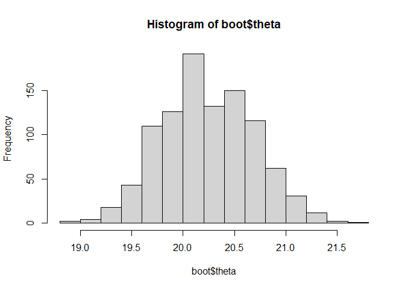
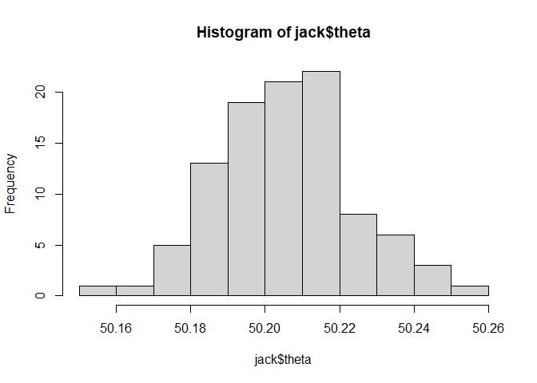
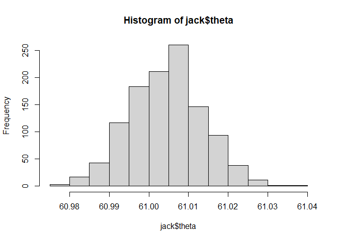
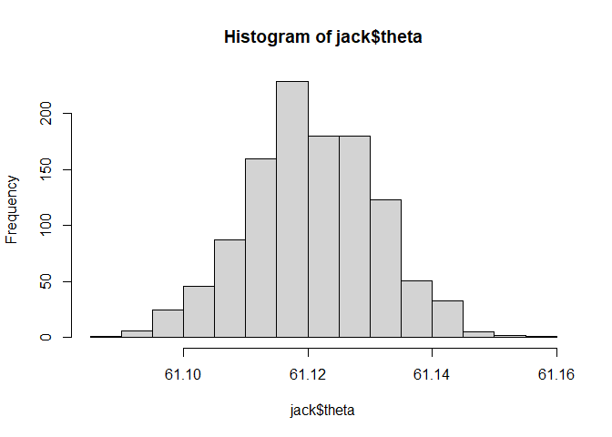

# Resampling  

Materi
======

Sering kita dihadapkan pada permasalahan, hanya mendapatkan jumlah
sampel yang kecil dalam suatu pemodelan dan dikhawatirkan parameter yang
diperoleh bias, underestimate atau overestimate. Salah satu cara
mengatasinya adalah dengan teknik resampling Bootstrap dan Jackknife.
Bootstrap dan Jackknife adalah teknik nonparametrik dan resampling yang
bertujuan untuk menaksir standar eror dan confidence interval parameter
populasi, seperti : mean, median, proporsi, koefisien korelasi dan
regresi, dengan tidak selalu memperhatikan asumsi distribusi. Jackknife
sendiri adalah alternatif dari bootstrap.

Bootstrap
=========

Prosedur Bootstrap :

1.  Menarik n-sampel acak dari suatu populasi sebanyak satu kali.
    (Mengambil sample 𝑥)
2.  Dari sampel yang didapat, lakukan resample dengan pengembalian
    (non-parametrik) atau ambil sub-sampel acak dari distribusi teoritis
    populasi yang diasumsikan dengan estimasi parameter dari data sampel
    yang didapat (parametrik)
3.  Dari sub-sampel yang ada, estimasikan nilai parameter yang ingin
    didapat, dinotasikan dengan 𝜃̂𝑏1, 𝜃̂𝑏2, . . ., 𝜃̂𝑏𝐵 , bentuk umumnya
    𝜃̂𝑏𝑖.
4.  Ulangi langkah 2 dan 3 sebanyak B kali yang mungkin
    (direkomendasikan 𝐵 = 1000 atau lebih untuk mengestimasi confidence
    Interval)
5.  Dari semua estimasi parameter sub-sampel (𝜃̂𝑏1, 𝜃̂𝑏2, . . ., 𝜃̂𝑏𝐵 ),
    hitung rata – ratanya untuk mendapatkan estimasi parameter dan
    standard deviasinya untuk nilai standard error

Membuat Fungsi Sendiri
----------------------

``` r
bootstrap <- function(x, iter = 1000, FUN = "mean", alpa = 0.05, ...){
      theta <- NULL
      n <- length(x)
      for(i in 1:iter){
            my_sample <- sample(x, replace = TRUE)
            theta[i] <- do.call(FUN, list(my_sample, ...))
      }
      rata2 <- mean(theta)
      bias <-  mean(theta) - mean(x)
      se <- sqrt(var(theta) / n)
      lower_confidence <- rata2 - qt(alpa/2, n -1, lower.tail = FALSE) * se
      upper_confidence <- rata2 + qt(alpa/2, n -1, lower.tail = FALSE) * se
      
      list(theta = theta,
           mean_theta = rata2,
           bias = bias,
           se = se,
           lower_ci = lower_confidence,
           upper_ci = upper_confidence,
           alpa = alpa,
           iter = iter,
           FUN = substitute(FUN))
}
```

Mencoba Fungsi Buatan
---------------------

### Membuat Data Dummy

``` r
set.seed(270100)
x <- rnorm(100, mean = 20, sd = 4)
mean(x)
```

    ## [1] 20.22901

### Menjalankan Bootstrap Sampling

``` r
boot <- bootstrap(x, FUN = "mean")
boot[-1]
```

    ## $mean_theta
    ## [1] 20.23537
    ## 
    ## $bias
    ## [1] 0.006359059
    ## 
    ## $se
    ## [1] 0.04465458
    ## 
    ## $lower_ci
    ## [1] 20.14676
    ## 
    ## $upper_ci
    ## [1] 20.32397
    ## 
    ## $alpa
    ## [1] 0.05
    ## 
    ## $iter
    ## [1] 1000
    ## 
    ## $FUN
    ## [1] "mean"

``` r
hist(boot$theta)
```



Jacknife
========

Prosedur Jacknife sebagai berikut.

1.  Menarik n-sampel acak dari suatu populasi sebanyak satu kali.
    (Mengambil sample 𝑥)
2.  Resample dengan mengeluarkan elemen sampel ke i (𝑖 = 1,2,… ,𝑛).
    Didapatkan resample ke-i (𝑖 = 1,2,…,𝑛). Setiap hasil resample akan
    berukuran (n-1)
3.  Perhitungan penaksir setiap hasil resample, didapatkan : 𝜃̂𝑗1, 𝜃̂𝑗2, .
    . ., 𝜃̂𝑗𝑛 ; bentuk umumnya 𝜃̂𝑗𝑖.
4.  Rata-ratakan penaksir yang didapatkan dari setiap hasil resample.

Membuat Fungsi Sendiri
----------------------

``` r
jacknife_manual <- function(x, FUN = "mean", alpa = 0.05, ...){
      theta <-  NULL
      n <- length(x)
      for(i in 1:n){
            my_sample <- x[-i]
            theta[i] <- do.call(FUN, list(my_sample, ...))
      }
     
      rata2 <- mean(theta)
      bias <-  mean(theta) - mean(x)
      se <- sqrt(var(theta) / n)
      lower_confidence <- rata2 - qt(alpa/2, n -1, lower.tail = FALSE) * se
      upper_confidence <- rata2 + qt(alpa/2, n -1, lower.tail = FALSE) * se
      
      list(theta = theta,
           bias =  bias,
           se = se,
           lower_ci = lower_confidence,
           upper_ci = upper_confidence,
           alpa = alpa,
           n = n,
           FUN = substitute(FUN))
}
```

Mencoba Fungsi Buatan
---------------------

### Membuat Data Dummy

``` r
y <- rnorm(100, 50, 2)
mean(y)
```

    ## [1] 50.20477

``` r
se <- sqrt(var(y)/length(y))
se
```

    ## [1] 0.1805137

### Jacknife Sampling

``` r
jack <- jacknife_manual(y)
jack[-1]
```

    ## $bias
    ## [1] 0
    ## 
    ## $se
    ## [1] 0.001823371
    ## 
    ## $lower_ci
    ## [1] 50.20116
    ## 
    ## $upper_ci
    ## [1] 50.20839
    ## 
    ## $alpa
    ## [1] 0.05
    ## 
    ## $n
    ## [1] 100
    ## 
    ## $FUN
    ## [1] "mean"

``` r
hist(jack$theta)
```



Pembahasan Latihan Soal
=======================

Nomor 1
-------

Gunakan prosedur bootstrap untuk menduga parameter pada model regresi
dari data marketing package datarium

### Pembahasan Nomor 1

### Load Data

``` r
# install.packages("datarium")
data("marketing", package = "datarium")
kable(head(marketing, 10))
```

|  youtube|  facebook|  newspaper|  sales|
|--------:|---------:|----------:|------:|
|   276.12|     45.36|      83.04|  26.52|
|    53.40|     47.16|      54.12|  12.48|
|    20.64|     55.08|      83.16|  11.16|
|   181.80|     49.56|      70.20|  22.20|
|   216.96|     12.96|      70.08|  15.48|
|    10.44|     58.68|      90.00|   8.64|
|    69.00|     39.36|      28.20|  14.16|
|   144.24|     23.52|      13.92|  15.84|
|    10.32|      2.52|       1.20|   5.76|
|   239.76|      3.12|      25.44|  12.72|

### Model Awal

Model yang akan dibuat adalah regresi liniear sederhana, melibatkan
variabel `sales` sebagai variabel dependent dan variabel `youtube`
sebagai variabel independet

``` r
model <- lm(sales ~ youtube, data = marketing)
coef(model)
```

    ## (Intercept)     youtube 
    ##  8.43911226  0.04753664

### Bootstrap

``` r
boot <- NULL
for (i in 1:nrow(marketing)){
   index_selected <- sample(nrow(marketing), replace = TRUE)
   my_sample <- marketing[index_selected, ]   
   model <- lm(sales ~ youtube, data = my_sample)
   if(is.null(boot))
      boot <- rbind(coef(model))
   else
      boot <- rbind(boot, coef(model))
   
}
boot <- data.frame(boot)
kable(head(boot, 10))
```

|  X.Intercept.|    youtube|
|-------------:|----------:|
|      8.526155|  0.0460684|
|      9.091003|  0.0424254|
|      8.453949|  0.0477486|
|      8.669956|  0.0458903|
|      8.955290|  0.0465536|
|      8.282357|  0.0471755|
|      7.989682|  0.0482682|
|      8.886038|  0.0425140|
|      8.732099|  0.0456655|
|      8.567410|  0.0481592|

``` r
result <- sapply(boot, function(x){
   mean_boot <-  mean(x)
   se_boot = sqrt(var(x) / length(x))
   df <- length(x) - 1
   ci_95_lower <- mean_boot - qt(0.05, df, lower.tail = FALSE) * se_boot
   ci_95_upper <- mean_boot + qt(0.05, df, lower.tail = FALSE) * se_boot
   
   c(mean_boot = mean_boot,
     se_boot = se_boot,
     ci_95_lower = ci_95_lower,
     ci_95_upper = ci_95_upper)
})

kable(result)
```

|               |  X.Intercept.|    youtube|
|:--------------|-------------:|----------:|
| mean\_boot    |     8.4862138|  0.0472032|
| se\_boot      |     0.0251932|  0.0001883|
| ci\_95\_lower |     8.4445809|  0.0468920|
| ci\_95\_upper |     8.5278467|  0.0475143|

### Pembahasan Nomor 1

Nomor 2
-------

Dengan menggunakan data\_dummy\_komstat.csv. Gunakan prosedur Jacknife
untuk menduga rata-rata dari variabel sesudah dan sebelum

### Pembahasan Nomor 2

#### Load Data

``` r
data <- read.csv("https://raw.githubusercontent.com/modul60stis/data/main/data_dummy_komstat.csv")
kable(head(data, 10))
```

|  sebelum|  sesudah| jenis\_kelamin | metode | puas  |
|--------:|--------:|:---------------|:-------|:------|
|       72|       64| Laki-Laki      | B      | Tidak |
|       51|       43| Laki-Laki      | C      | Tidak |
|       51|       59| Laki-Laki      | D      | Tidak |
|       66|       65| Perempuan      | B      | Ya    |
|       51|       56| Laki-Laki      | A      | Ya    |
|       63|       61| Laki-Laki      | A      | Ya    |
|       57|       50| Perempuan      | A      | Ya    |
|       65|       61| Perempuan      | C      | Ya    |
|       64|       58| Laki-Laki      | A      | Ya    |
|       73|       82| Perempuan      | B      | Ya    |

#### Jacknife Pada Variabel `sebelum`

``` r
jack <- jacknife_manual(data$sebelum)
jack[-1]
```

    ## $bias
    ## [1] 0
    ## 
    ## $se
    ## [1] 0.0002704663
    ## 
    ## $lower_ci
    ## [1] 61.00391
    ## 
    ## $upper_ci
    ## [1] 61.00497
    ## 
    ## $alpa
    ## [1] 0.05
    ## 
    ## $n
    ## [1] 1127
    ## 
    ## $FUN
    ## [1] "mean"

#### Visualisasi Sebaran Nilai Penduga Jacknife

``` r
hist(jack$theta)
```



#### Jacknife Pada Variabel `sesudah`

``` r
jack <- jacknife_manual(data$sesudah)
jack[-1]
```

    ## $bias
    ## [1] 0
    ## 
    ## $se
    ## [1] 0.0003138365
    ## 
    ## $lower_ci
    ## [1] 61.12006
    ## 
    ## $upper_ci
    ## [1] 61.12129
    ## 
    ## $alpa
    ## [1] 0.05
    ## 
    ## $n
    ## [1] 1127
    ## 
    ## $FUN
    ## [1] "mean"

#### Visualisasi Sebaran Nilai Penduga Jacknife

``` r
hist(jack$theta)
```




