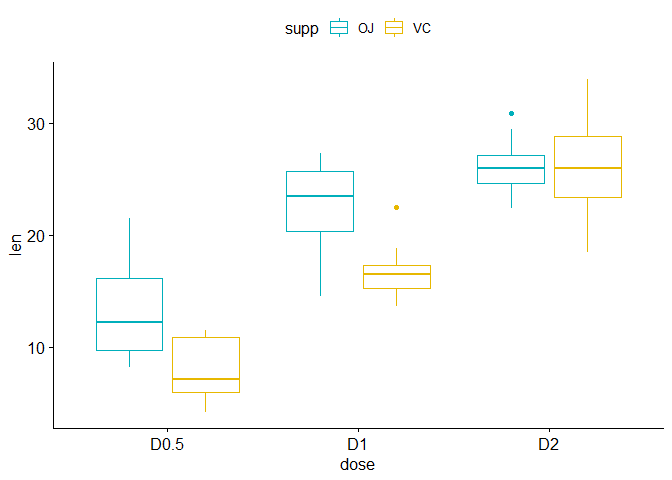
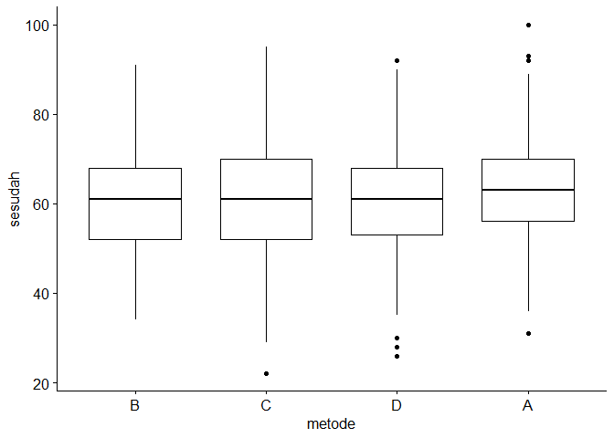

# Anova  


Materi
======

**Acuan Materi**

1.  [One-Way ANOVA Test in
    R](http://www.sthda.com/english/wiki/one-way-anova-test-in-r)
2.  [Two-Way ANOVA Test in
    R](http://www.sthda.com/english/wiki/two-way-anova-test-in-r)
3.  [One-Way vs Two-Way ANOVA: Differences, Assumptions and
    Hypotheses](https://www.technologynetworks.com/informatics/articles/one-way-vs-two-way-anova-definition-differences-assumptions-and-hypotheses-306553)
4.  [Analisis Ragam / Analysis of variance (Anova) dua arah dengan
    interaksi](https://statistikceria.blogspot.com/2014/01/analisis-ragam-analysis-of-variance-anova-dua-arah-dengan-interaksi.html)
5.  [Understanding Interaction Effects in
    Statistics](https://statisticsbyjim.com/regression/interaction-effects/)

One Way Anova
=============

Pengujian ini digunakan pada data kuantitatif untuk menentukan apakah
ada perbedaan diantara beberapa populasi rata-ratanya. Nama dari
pengujian yaitu ANOVA (analysis of variances) diambil berdasarkan cara
perhitungan yang digunakan yaitu suatu teknik yang menganalisa variasi
data untuk menentukan apakah kita dapat menyatakan ada perbedaan
diantara rata-rata populasi yang kita teliti. Asumsi pada uji Anova ini
adalah **data bersifat independent**, **berdistribusi normal**, dan
**memiliki varians yang sama**. Jika asumsi kenormalan dan varians tidak
terpenuhi maka uji ANOVA dapat diganti dengan uji Kruskal-Wallis (uji
non-parametrik). Hipotesa untuk pengujian k populasi ditulis sebagai
berikut:

-   𝐻0: 𝜇1=𝜇2= … =𝜇𝑘
-   𝐻1: Setidaknya ada satu 𝜇𝑖 yang tidak sama

``` r
my_data <- PlantGrowth
kable(dplyr::sample_n(my_data, 10))
```

|  weight| group |
|-------:|:------|
|    5.18| ctrl  |
|    4.41| trt1  |
|    5.17| ctrl  |
|    4.50| ctrl  |
|    5.50| trt2  |
|    5.37| trt2  |
|    4.61| ctrl  |
|    4.89| trt1  |
|    6.31| trt2  |
|    5.14| ctrl  |

Uji Anova
---------

Untuk melakukan analisis anova dapat menggunakan fungsi
`aov(y ~ x, data)`

``` r
res.aov <- aov(weight ~ group, data = my_data)
summary(res.aov)
```

    ##             Df Sum Sq Mean Sq F value Pr(>F)  
    ## group        2  3.766  1.8832   4.846 0.0159 *
    ## Residuals   27 10.492  0.3886                 
    ## ---
    ## Signif. codes:  0 '***' 0.001 '**' 0.01 '*' 0.05 '.' 0.1 ' ' 1

Telihat bahwa p-value sebesar 0.0159, sehingga dengantingkat
signifikansi 5%, terdapat rata-rata yang berbeda

Posthoc Test
------------

**Jika dalam pengujian ANOVA 𝑯𝟎 ditolak**, maka untuk mengetahui
seberapa besar pengaruhnya, maka dilakukan uji menggunakan analisis
perbandingan ganda atau posthoc test. Syarat dapat dilakukannya
pengujian perbandingan ganda ini adalah jumlah level faktornya
(perlakuan) lebih dari dua. Salah satu uji perbandingan ganda adalah uji
Tukey.

``` r
TukeyHSD(res.aov)
```

    ##   Tukey multiple comparisons of means
    ##     95% family-wise confidence level
    ## 
    ## Fit: aov(formula = weight ~ group, data = my_data)
    ## 
    ## $group
    ##             diff        lwr       upr     p adj
    ## trt1-ctrl -0.371 -1.0622161 0.3202161 0.3908711
    ## trt2-ctrl  0.494 -0.1972161 1.1852161 0.1979960
    ## trt2-trt1  0.865  0.1737839 1.5562161 0.0120064

Berdasarkan p-value yang diperoleh, terlihat bahwa perbedaan rata-rata
yang signifikan hanya terdapat pada grup `trt2` dan `trt2` dengan
p-value adjusted sebesar `0.012`

Two Way Anova
=============

Asumsi pada Two-Way Anova sama seperti pada One-Way Anova

Preprocessing
-------------

``` r
my_data <- ToothGrowth
kable(dplyr::sample_n(my_data, 10))
```

|   len| supp |  dose|
|-----:|:-----|-----:|
|  21.5| OJ   |   0.5|
|  25.2| OJ   |   1.0|
|  23.3| VC   |   2.0|
|  25.8| OJ   |   1.0|
|  16.5| VC   |   1.0|
|  27.3| OJ   |   1.0|
|  22.4| OJ   |   2.0|
|  24.5| OJ   |   2.0|
|  16.5| VC   |   1.0|
|  22.5| VC   |   1.0|

Konversi variabel `dose` ke factor

``` r
my_data$dose <- factor(my_data$dose, 
                  levels = c(0.5, 1, 2),
                  labels = c("D0.5", "D1", "D2"))
kable(head(my_data))
```

|   len| supp | dose |
|-----:|:-----|:-----|
|   4.2| VC   | D0.5 |
|  11.5| VC   | D0.5 |
|   7.3| VC   | D0.5 |
|   5.8| VC   | D0.5 |
|   6.4| VC   | D0.5 |
|  10.0| VC   | D0.5 |

Tanpa Interaksi
---------------

``` r
res.aov2 <- aov(len ~ supp + dose, data = my_data)
summary(res.aov2)
```

    ##             Df Sum Sq Mean Sq F value   Pr(>F)    
    ## supp         1  205.4   205.4   14.02 0.000429 ***
    ## dose         2 2426.4  1213.2   82.81  < 2e-16 ***
    ## Residuals   56  820.4    14.7                     
    ## ---
    ## Signif. codes:  0 '***' 0.001 '**' 0.01 '*' 0.05 '.' 0.1 ' ' 1

Terlihat bahwa kedua grup signifikan, yang berarti variabel `supp` dan
`dose` memberikan dampak pada rata-rata tooth length

Dengan Interaksi
----------------

``` r
res.aov3 <- aov(len ~ supp + dose + supp:dose, data = my_data)
summary(res.aov3)
```

    ##             Df Sum Sq Mean Sq F value   Pr(>F)    
    ## supp         1  205.4   205.4  15.572 0.000231 ***
    ## dose         2 2426.4  1213.2  92.000  < 2e-16 ***
    ## supp:dose    2  108.3    54.2   4.107 0.021860 *  
    ## Residuals   54  712.1    13.2                     
    ## ---
    ## Signif. codes:  0 '***' 0.001 '**' 0.01 '*' 0.05 '.' 0.1 ' ' 1

Terlihat bahwa efek interaksi juga signifikan, yang berarti hubungan
antara tooth length dan `supp` bergantung pada variabel `dose`

Posthoc Test
------------

``` r
TukeyHSD(res.aov3, which = "dose")
```

    ##   Tukey multiple comparisons of means
    ##     95% family-wise confidence level
    ## 
    ## Fit: aov(formula = len ~ supp + dose + supp:dose, data = my_data)
    ## 
    ## $dose
    ##           diff       lwr       upr   p adj
    ## D1-D0.5  9.130  6.362488 11.897512 0.0e+00
    ## D2-D0.5 15.495 12.727488 18.262512 0.0e+00
    ## D2-D1    6.365  3.597488  9.132512 2.7e-06

Terlihat bahwa semuanya signifikan dengan adjusted p-value \< 0.05. Yang
berarti rata-rata dari tiap dosis berbeda dan jika diliat lebih jauh
bertambahnya dosis rata-ratanya semakin tinggi.

``` r
library("ggpubr")
```

    ## Warning: package 'ggpubr' was built under R version 4.0.3

    ## Loading required package: ggplot2

``` r
ggboxplot(my_data, x = "dose", y = "len", color = "supp",
          palette = c("#00AFBB", "#E7B800"))
```



Pembahasan Latihan Soal
=======================

Dengan data\_dummy\_komstat.csv dan 𝛼=0.025

``` r
data <- read.csv("https://raw.githubusercontent.com/modul60stis/data/main/data_dummy_komstat.csv")
kable(head(data, 10))
```

|  sebelum|  sesudah| jenis\_kelamin | metode | puas  |
|--------:|--------:|:---------------|:-------|:------|
|       72|       64| Laki-Laki      | B      | Tidak |
|       51|       43| Laki-Laki      | C      | Tidak |
|       51|       59| Laki-Laki      | D      | Tidak |
|       66|       65| Perempuan      | B      | Ya    |
|       51|       56| Laki-Laki      | A      | Ya    |
|       63|       61| Laki-Laki      | A      | Ya    |
|       57|       50| Perempuan      | A      | Ya    |
|       65|       61| Perempuan      | C      | Ya    |
|       64|       58| Laki-Laki      | A      | Ya    |
|       73|       82| Perempuan      | B      | Ya    |

Nomor 1
-------

Apakah ada pengaruh yang berbeda dari metode pengajaran terhadap nilai
yang dipeorleh (variabel sesudah)?

### Pembahasan Nomor 1

#### Eksplorasi Data

``` r
library("ggpubr")
ggboxplot(data, x = "metode", y = "sesudah")
```



Secara visual tidak terlihat perbedaan rata-rata yang terlalu signifikan

#### Uji Normalitas

``` r
tapply(data$sesudah, data$metode, shapiro.test)
```

    ## $A
    ## 
    ##  Shapiro-Wilk normality test
    ## 
    ## data:  X[[i]]
    ## W = 0.99515, p-value = 0.5443
    ## 
    ## 
    ## $B
    ## 
    ##  Shapiro-Wilk normality test
    ## 
    ## data:  X[[i]]
    ## W = 0.99455, p-value = 0.3715
    ## 
    ## 
    ## $C
    ## 
    ##  Shapiro-Wilk normality test
    ## 
    ## data:  X[[i]]
    ## W = 0.99518, p-value = 0.5284
    ## 
    ## 
    ## $D
    ## 
    ##  Shapiro-Wilk normality test
    ## 
    ## data:  X[[i]]
    ## W = 0.99607, p-value = 0.7235

Terlihat bahawa p-value lebih besar dari 0.025, sehingga dapat
disimpulkan data berdistribusi normal untuk semua metode

#### Uji Kesamaan Varias

``` r
library(car)
leveneTest(sesudah ~ metode, data = data)
```

    ## Levene's Test for Homogeneity of Variance (center = median)
    ##         Df F value Pr(>F)
    ## group    3  1.3612 0.2532
    ##       1123

karena p-value lebih besar dari 0.025 maka gagal tolak H0, yang berarti
variansnya sama.

#### Uji Anova

Karena semua asumsi telah terpenuhi maka dapat dilakukan uji anova

``` r
res.aov <- aov(sesudah ~ metode, data = data)
summary(res.aov)
```

    ##               Df Sum Sq Mean Sq F value Pr(>F)  
    ## metode         3   1085   361.5    2.58 0.0523 .
    ## Residuals   1123 157385   140.1                 
    ## ---
    ## Signif. codes:  0 '***' 0.001 '**' 0.01 '*' 0.05 '.' 0.1 ' ' 1

di peroleh p-value 0.0523, yang berarti gagal tolak H0 untuk alpa 0.025.
Sehingga dapat disimpulkan bahwa tidak ada pengaruh yang signifikan dari
metode pengajaran terhadap nilai yang dipeorleh (variabel sesudah).

Karena gagal tolak H0 maka tidak perlu dilakukan uji perbandingan ganda
atau posthoc test

Nomor 2
-------

Apakah metode pengajaran dan jenis kelamin mempengaruhi nilai yang
diperoleh? Liat juga interaksi antara metode pengajaran dan jenis
kelamin!

### Pembahasan Nomor 2

Silahkan eksplore terlebih dahulu datanya kemudian uji kenormalan untuk
setiap kelompok dan uji kesamaan varians untuk semua kelompok.

Disini saya akan berasumsi bahwa data telah normal dan memiliki varians
yang sama sehingga dapat dilanjutkan dengan analisis anova dua arah.
Model yang akan dibuat adalah yang tanpa interaksi

``` r
res.aov <- aov(sesudah ~ metode + jenis_kelamin, data = data)
summary(res.aov)
```

    ##                 Df Sum Sq Mean Sq F value Pr(>F)  
    ## metode           3   1085   361.5   2.579 0.0523 .
    ## jenis_kelamin    1     93    93.0   0.664 0.4154  
    ## Residuals     1122 157292   140.2                 
    ## ---
    ## Signif. codes:  0 '***' 0.001 '**' 0.01 '*' 0.05 '.' 0.1 ' ' 1

Terlihat bahwa tidak ada yang signifikan pada alpa 0.025. Hal ini
menunjukkan bahwa jenis kelamin dan metode pengajaran tidak berpengaruh
signifikan terhadap rata-rata nilai yang diperoleh


