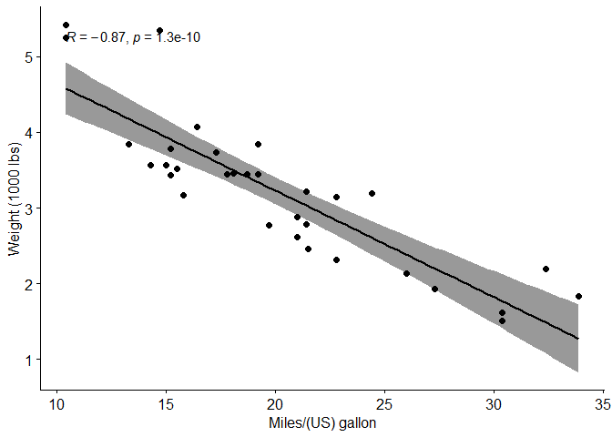
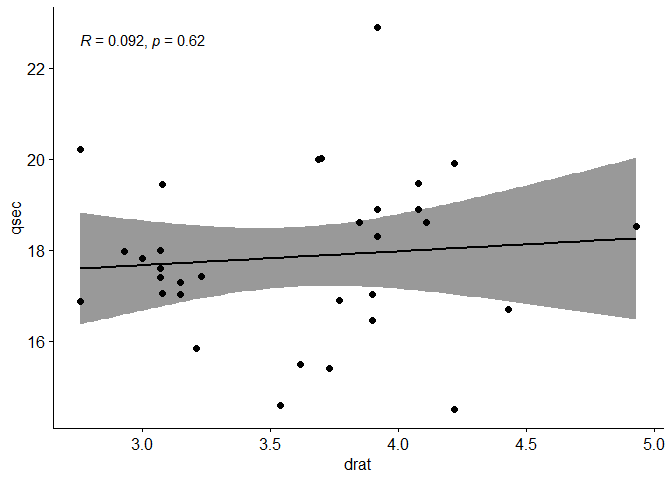
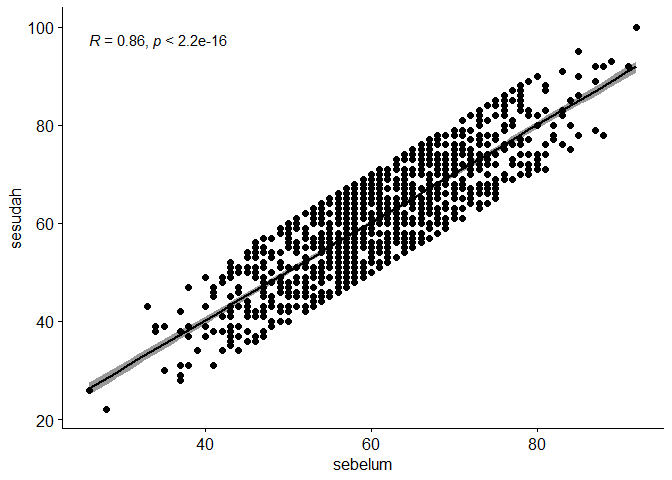
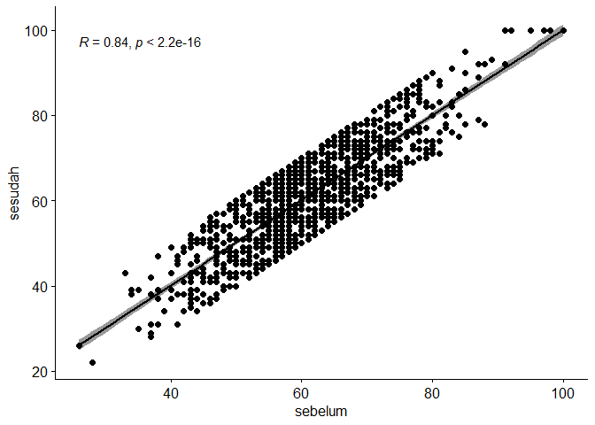

# Korelasi  


Acuan Materi
============

1.  [Correlation Test Between Two Variables in
    R](http://www.sthda.com/english/wiki/correlation-test-between-two-variables-in-r)

``` r
my_data <- mtcars
kable(dplyr::sample_n(my_data, 10))
```

|                    |   mpg|  cyl|   disp|   hp|  drat|     wt|   qsec|   vs|   am|  gear|  carb|
|:-------------------|-----:|----:|------:|----:|-----:|------:|------:|----:|----:|-----:|-----:|
| Merc 240D          |  24.4|    4|  146.7|   62|  3.69|  3.190|  20.00|    1|    0|     4|     2|
| Maserati Bora      |  15.0|    8|  301.0|  335|  3.54|  3.570|  14.60|    0|    1|     5|     8|
| Ford Pantera L     |  15.8|    8|  351.0|  264|  4.22|  3.170|  14.50|    0|    1|     5|     4|
| Cadillac Fleetwood |  10.4|    8|  472.0|  205|  2.93|  5.250|  17.98|    0|    0|     3|     4|
| Merc 280           |  19.2|    6|  167.6|  123|  3.92|  3.440|  18.30|    1|    0|     4|     4|
| Toyota Corolla     |  33.9|    4|   71.1|   65|  4.22|  1.835|  19.90|    1|    1|     4|     1|
| Ferrari Dino       |  19.7|    6|  145.0|  175|  3.62|  2.770|  15.50|    0|    1|     5|     6|
| Merc 450SL         |  17.3|    8|  275.8|  180|  3.07|  3.730|  17.60|    0|    0|     3|     3|
| Hornet 4 Drive     |  21.4|    6|  258.0|  110|  3.08|  3.215|  19.44|    1|    0|     3|     1|
| Valiant            |  18.1|    6|  225.0|  105|  2.76|  3.460|  20.22|    1|    0|     3|     1|

Korelasi Pearson
================

Koefisien korelasi Pearson dapat digunakan untuk menyatakan besar
hubungan linier antara dua variabel ketika data adalah data kuantitatif
(data berskala interval atau rasio) dan kedua variabel adalah bivariat
yang **berdistribusi normal**.

Hitung Korelasi
---------------

``` r
cor(my_data$wt, my_data$mpg, method = "pearson")
```

    ## [1] -0.8676594

Pearson Test
------------

``` r
res <- cor.test(my_data$wt, my_data$mpg, method = "pearson")
res
```

    ## 
    ##  Pearson's product-moment correlation
    ## 
    ## data:  my_data$wt and my_data$mpg
    ## t = -9.559, df = 30, p-value = 1.294e-10
    ## alternative hypothesis: true correlation is not equal to 0
    ## 95 percent confidence interval:
    ##  -0.9338264 -0.7440872
    ## sample estimates:
    ##        cor 
    ## -0.8676594

Terlihat bahwa p-value sangat kecil yang berarti tolak H0, sehingga
dapat disimpulkan terdapat korelasi antara variabel `wt` dan `mpg`

Visualisasi
-----------

``` r
library("ggpubr")
ggscatter(my_data, x = "mpg", y = "wt", 
          add = "reg.line", conf.int = TRUE, 
          cor.coef = TRUE, cor.method = "pearson",
          xlab = "Miles/(US) gallon", ylab = "Weight (1000 lbs)")
```



Korelasi Spearman
=================

Statistik ini merupakan suatu ukuran asosiasi atau hubungan yang dapat
digunakan pada kondisi satu atau kedua variabel yang diukur adalah skala
ordinal (berbentuk ranking) atau kedua variabel adalah kuantitatif namun
**kondisi normal tidak terpenuhi**.

Hitung Korelasi
---------------

``` r
cor(my_data$drat, my_data$qsec, method = "spearman")
```

    ## [1] 0.09186863

Spearman Test
-------------

``` r
res <- cor.test(my_data$drat, my_data$qsec, method = "spearman")
res
```

    ## 
    ##  Spearman's rank correlation rho
    ## 
    ## data:  my_data$drat and my_data$qsec
    ## S = 4954.8, p-value = 0.617
    ## alternative hypothesis: true rho is not equal to 0
    ## sample estimates:
    ##        rho 
    ## 0.09186863

Terlihat bahwa p-value sangat besar, sehingga gagal tolak H0, yang
berarti berdasarkan Spearman test tidak terdapat korelasi antara
variabel `drat` dan `qsec`

Visualisasi
-----------

``` r
library("ggpubr")
ggscatter(my_data, x = "drat", y = "qsec", 
          add = "reg.line", conf.int = TRUE, 
          cor.coef = TRUE, cor.method = "spearman")
```



Pembahasan Latihan Soal
=======================

Dengan menggunakan data\_dummy\_komstat.csv dan 𝛼=0.05

``` r
data <- read.csv("https://raw.githubusercontent.com/modul60stis/data/main/data_dummy_komstat.csv")
kable(head(data, 10))
```

|  sebelum|  sesudah| jenis\_kelamin | metode | puas  |
|--------:|--------:|:---------------|:-------|:------|
|       72|       64| Laki-Laki      | B      | Tidak |
|       51|       43| Laki-Laki      | C      | Tidak |
|       51|       59| Laki-Laki      | D      | Tidak |
|       66|       65| Perempuan      | B      | Ya    |
|       51|       56| Laki-Laki      | A      | Ya    |
|       63|       61| Laki-Laki      | A      | Ya    |
|       57|       50| Perempuan      | A      | Ya    |
|       65|       61| Perempuan      | C      | Ya    |
|       64|       58| Laki-Laki      | A      | Ya    |
|       73|       82| Perempuan      | B      | Ya    |

Nomor 1
-------

Hitung dan ujilah, korelasi dari variabel sebelum dan sesudah.

### Pembahasan Nomor 1

#### Cek Normalitas

``` r
shapiro.test(data$sebelum)
```

    ## 
    ##  Shapiro-Wilk normality test
    ## 
    ## data:  data$sebelum
    ## W = 0.99836, p-value = 0.3633

``` r
shapiro.test(data$sesudah)
```

    ## 
    ##  Shapiro-Wilk normality test
    ## 
    ## data:  data$sesudah
    ## W = 0.9987, p-value = 0.588

Terlihat bahwa kedua variabel berdistribusi normal sehingga dapat diuji
dengan menggunakan korelasi Pearson

#### Hitung Korelasi

``` r
cor(data$sebelum, data$sesudah, method = "pearson")
```

    ## [1] 0.8557466

Terlihat bahwa korelasinya positif dan kuat, yaitu sebesar 0.8557. ini
menandakan pertambahan nilai pada variabel `sebelum` diikuti dengan
bertambahnya nilai pada variabel `sesudah`

#### Pearson Test

``` r
cor.test(data$sebelum, data$sesudah, method = "pearson")
```

    ## 
    ##  Pearson's product-moment correlation
    ## 
    ## data:  data$sebelum and data$sesudah
    ## t = 55.475, df = 1125, p-value < 2.2e-16
    ## alternative hypothesis: true correlation is not equal to 0
    ## 95 percent confidence interval:
    ##  0.8392923 0.8706347
    ## sample estimates:
    ##       cor 
    ## 0.8557466

Terlihat p-value lebih kecil dari 0.05, sehingga tolak H0, yang berarti
terbukti terdapat korelasi antara variable `sebelum` dan `sesudah`

#### Visualisasi

``` r
library(ggpubr)
ggscatter(data, x = "sebelum", y = "sesudah",
          add = "reg.line", conf.int = TRUE, 
          cor.coef = TRUE, cor.method = "pearson")
```



Nomor 2
-------

Jika ternyata ada ketambahan 6 sampel baru seperti tabel dibawah, hitung
dan uji kembali korelasi dari variabel sebelum dan sesudah.

| Sebelum | Sesudah | Jenis Kelamin | Metode | Puas  |
|---------|---------|---------------|--------|-------|
| 91      | 100     | Laki-Laki     | B      | Ya    |
| 95      | 100     | Perempuan     | D      | Ya    |
| 97      | 100     | Laki-Laki     | A      | Ya    |
| 98      | 100     | Laki-Laki     | C      | Ya    |
| 98      | 100     | Perempuan     | A      | Ya    |
| 100     | 100     | Perempuan     | C      | Tidak |

### Pembahasan Nomor 2

#### Gabung Data Baru

``` r
newData <- data.frame(sebelum = c(91, 95, 97, 98, 98, 100),
                      sesudah = rep(100, 6),
                      jenis_kelamin = c("Laki-Laki", "Perempuan", "Laki-Laki", "Laki-Laki", "Perempuan", "Perempuan"),
                      metode = c("B", "D", "A", "C", "A", "C"),
                      puas = c(rep("Ya", 5), "Tidak"))
data2 <- rbind(data, newData)
kable(tail(data2, 10))
```

|      |  sebelum|  sesudah| jenis\_kelamin | metode | puas  |
|:-----|--------:|--------:|:---------------|:-------|:------|
| 1124 |       77|       73| Laki-Laki      | A      | Ya    |
| 1125 |       78|       84| Laki-Laki      | B      | Tidak |
| 1126 |       58|       64| Laki-Laki      | B      | Tidak |
| 1127 |       59|       58| Perempuan      | C      | Ya    |
| 1128 |       91|      100| Laki-Laki      | B      | Ya    |
| 1129 |       95|      100| Perempuan      | D      | Ya    |
| 1130 |       97|      100| Laki-Laki      | A      | Ya    |
| 1131 |       98|      100| Laki-Laki      | C      | Ya    |
| 1132 |       98|      100| Perempuan      | A      | Ya    |
| 1133 |      100|      100| Perempuan      | C      | Tidak |

#### Cek Normalitas

``` r
shapiro.test(data2$sebelum)
```

    ## 
    ##  Shapiro-Wilk normality test
    ## 
    ## data:  data2$sebelum
    ## W = 0.99642, p-value = 0.01051

``` r
shapiro.test(data2$sesudah)
```

    ## 
    ##  Shapiro-Wilk normality test
    ## 
    ## data:  data2$sesudah
    ## W = 0.99682, p-value = 0.02182

Terlihat bahwa penambahan 6 data tersebut membuat kedua variabel tidak
normal. Sehingga akan dilanjutkan dengan korelasi Spearman

#### Hitung Korelasi

``` r
cor(data2$sebelum, data2$sesudah, method = "spearman")
```

    ## [1] 0.8390029

Terlihat bahwa korelasinya positif dan kuat, yaitu sebesar 0.839. ini
menandakan pertambahan nilai pada variabel `sebelum` diikuti dengan
bertambahnya nilai pada variabel `sesudah`

#### Spearman Test

``` r
cor.test(data2$sebelum, data2$sesudah, method = "spearman")
```

    ## 
    ##  Spearman's rank correlation rho
    ## 
    ## data:  data2$sebelum and data2$sesudah
    ## S = 39026191, p-value < 2.2e-16
    ## alternative hypothesis: true rho is not equal to 0
    ## sample estimates:
    ##       rho 
    ## 0.8390029

Terlihat p-value lebih kecil dari 0.05, sehingga tolak H0, yang berarti
terbukti terdapat korelasi antara variable `sebelum` dan `sesudah`
dengan tambahan 6 data baru

#### Visualisasi

``` r
library(ggpubr)
ggscatter(data2, x = "sebelum", y = "sesudah",
          add = "reg.line", conf.int = TRUE, 
          cor.coef = TRUE, cor.method = "spearman")
```




