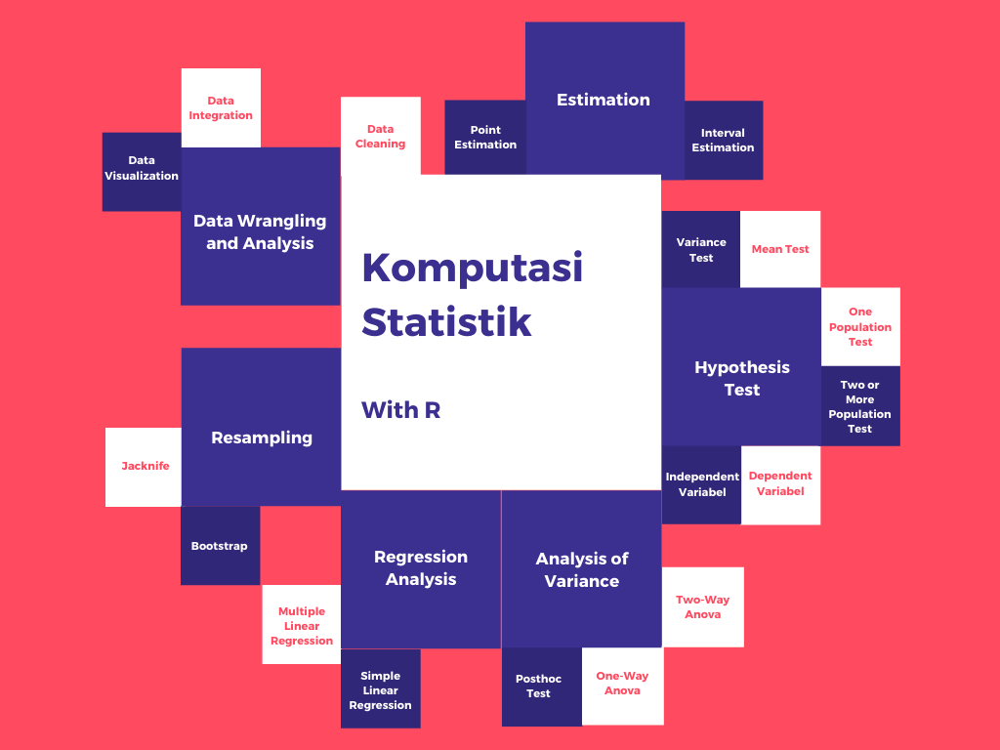

# Komputasi Statistik - UAS  

## Mind Map

## Cara Menggunakan

Untuk memakai source code silahkan klik tombol `Code` kemudian pilih `Download ZIP` atau silahkan clone repository ini ke komputermu. Source code yang tersedia adalah:
1. R, yang tersedia adalah file `.Rmd` dan `.html`. Untuk menggunakan file `.Rmd` silahkan menggunakan aplikasi [RStudio](https://rstudio.com/)

Jika source code yang tersedia terdapat kesalahan silahkan hubungi Tim Modul 60 atau langsung lakukan **pull request** ke repository ini.

Jika kalian ingin **berkontribusi** silahkan forking repository ini dan lakukan **pull request**.

## Kontent

1. [Statistik Sederhana](https://github.com/modul60stis/komstat-uas/tree/main/1_statistik_sederhana#statistik-sederhana-)
2. [Distribusi Peluang](https://github.com/modul60stis/komstat-uas/tree/main/2_distribusi_peluang#distibusi-peluang-)
3. [Estimasi Interval](https://github.com/modul60stis/komstat-uas/tree/main/3_estimasi_interval#estimasi-interval-)
4. [Uji Kesesuaian Sebaran](https://github.com/modul60stis/komstat-uas/tree/main/4_uji_kesesuaian_sebaran#uji-kesesuaian-sebaran-)
5. [Uji Ragam](https://github.com/modul60stis/komstat-uas/tree/main/5_uji_ragam#uji-ragam-)
6. [Uji Rata-Rata](https://github.com/modul60stis/komstat-uas/tree/main/6_uji_rata_rata#uji-rata-rata-)
7. [Uji Proporsi](https://github.com/modul60stis/komstat-uas/tree/main/7_uji_proporsi#uji-proporsi-)
8. [Anova](https://github.com/modul60stis/komstat-uas/tree/main/8_anova#anova-)
9. [Korelasi](https://github.com/modul60stis/komstat-uas/tree/main/9_korelasi#korelasi-)
10. [Regresi](https://github.com/modul60stis/komstat-uas/tree/main/10_regresi#regresi-)
11. [Resampling](https://github.com/modul60stis/komstat-uas/tree/main/11_resampling#resampling-)
12. [Tambahan : Fungsi Penting di R](https://github.com/modul60stis/komstat-uas/tree/main/0_r_programming/fungsi_penting#fungsi-penting-)
13. [Tambahan : Dplyr](https://github.com/modul60stis/komstat-uas/tree/main/0_r_programming/dplyr#dplyr-)
14. [Latihan : Data Wrangling and Analysis Challenge](https://github.com/modul60stis/komstat-uas/tree/main/data-wrangling%20-challenge#data-wrangling-and-analysis-challenge-)
15. [Pembahasan UAS 2017/2018](https://github.com/modul60stis/komstat-uas/tree/main/pembahasan-2017-2018#pembahasan-uas-tahun-20172018-)
16. [Pembahasan UAS 2018/2019](https://github.com/modul60stis/komstat-uas/tree/main/pembahasan-2018-2019#pembahasan-uas-tahun-20182019-)
17. [Pembahasan UAS 2019/2020](https://github.com/modul60stis/komstat-uas/tree/main/pembahasan-2019-2020#pembahasan-uas-tahun-20192020-)

##
 

*Code by Eko Putra Wahyuddin*

*-- TIm Modul 60*

