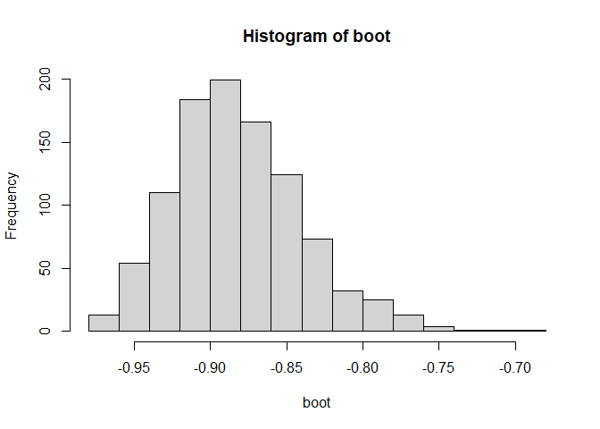

# Pembahasan UAS Tahun 2018/2019  

Load Library
============

``` r
library(datasets)
library(knitr)
```

Nomor 1
=======

Gunakanlah dataset dari R “OrchardSprays”. Data tersebut berasal dari
sebuah studi yang ingin mengetahui pengaruh dari beberapa perlakuan
(treatment) terhadap pengurangan jumlah lebah (decrease) yang mendekati
sebuah kebun buah. Dengan mengasumsikan bahwa variabel pengurangan
jumlah lebah (decrease) untuk tiap kategorik treatment memiliki varians
yang sama dan berdistribusi normal, kerjakanlah hal-hal berikut (dengan
menggunakan taraf uji 5%):

1.  Ujilah apakah rata-rata pengurangan jumlah lebah dari treatment A
    lebih kecil 2.8 dibandingkan rata-rata decrease dari treatment B.
2.  Ujilah apakah treatment C,D,F, dan H memberikan pengaruh yang
    berbeda terhadap besarnya pengurangan jumlah lebah? Lakukan analisis
    lanjutan jika diperlukan.

Ekspolorasi Data
----------------

``` r
df <- OrchardSprays
kable(head(df))
```

|  decrease|  rowpos|  colpos| treatment |
|---------:|-------:|-------:|:----------|
|        57|       1|       1| D         |
|        95|       2|       1| E         |
|         8|       3|       1| B         |
|        69|       4|       1| H         |
|        92|       5|       1| G         |
|        90|       6|       1| F         |

``` r
str(df)
```

    ## 'data.frame':    64 obs. of  4 variables:
    ##  $ decrease : num  57 95 8 69 92 90 15 2 84 6 ...
    ##  $ rowpos   : num  1 2 3 4 5 6 7 8 1 2 ...
    ##  $ colpos   : num  1 1 1 1 1 1 1 1 2 2 ...
    ##  $ treatment: Factor w/ 8 levels "A","B","C","D",..: 4 5 2 8 7 6 3 1 3 2 ...

Dataset terdiri dari 4 variabel. Level pada variabel treatment sebanyak 8. Level A menunjukkan perlakuan dengan kadar sulfur tertinggi, level B menunjukkan perlakuan dengan kadar sulfur tinggi, begitu seterusnya hingga level H yang menunjukkan perlakuan dengan tidak diberi kadar sulfur.

Bagian A : T-test
-----------------

Ujilah apakah rata-rata pengurangan jumlah lebah dari treatment A lebih
kecil 2.8 dibandingkan rata-rata decrease dari treatment B.

Populasi A merupakan populasi dengan treatment jenis A, dan populasi B
merupakan populasi dengan treatment jenis B.

``` r
popA <- df[df$treatment == "A",]
kable(popA)
```

|     |  decrease|  rowpos|  colpos| treatment |
|:----|---------:|-------:|-------:|:----------|
| 8   |         2|       8|       1| A         |
| 14  |         2|       6|       2| A         |
| 19  |         5|       3|       3| A         |
| 26  |         4|       2|       4| A         |
| 36  |         5|       4|       5| A         |
| 41  |        12|       1|       6| A         |
| 53  |         4|       5|       7| A         |
| 63  |         3|       7|       8| A         |

``` r
popB <- df[df$treatment == "B",]
kable(popB)
```

|     |  decrease|  rowpos|  colpos| treatment |
|:----|---------:|-------:|-------:|:----------|
| 3   |         8|       3|       1| B         |
| 10  |         6|       2|       2| B         |
| 24  |         4|       8|       3| B         |
| 31  |        10|       7|       4| B         |
| 38  |         7|       6|       5| B         |
| 45  |         4|       5|       6| B         |
| 49  |         8|       1|       7| B         |
| 60  |        14|       4|       8| B         |

Dengan mengasumsikan bahwa variabel pengurangan jumlah lebah (decrease)
untuk tiap kategori treatment memiliki varians yang sama dan
berdistribusi normal, maka digunakan T-test untuk Untuk mengetahui
apakah terdapat perbedaan rata-rata pengurangan jumlah lebah dari
treatment A dan B.

Dengan hipotesis :

-   H0 : mean A dan mean B sama
-   H1 : mean A - mean B \< 2.8

``` r
t.test(popA$decrease, popB$decrease, alternative = "less", mu = 2.8, var.equal = TRUE)
```

    ## 
    ##  Two Sample t-test
    ## 
    ## data:  popA$decrease and popB$decrease
    ## t = -3.5707, df = 14, p-value = 0.001536
    ## alternative hypothesis: true difference in means is less than 2.8
    ## 95 percent confidence interval:
    ##       -Inf -0.139081
    ## sample estimates:
    ## mean of x mean of y 
    ##     4.625     7.625

Didapatkan p-value sebesar 0.0015, di mana angka itu lebih kecil dari
alpha(0.05). Sehingga keputusan tolak H0. Dengan tingkat signifikansi
5%, terdapat cukup bukti untuk menyatakan bahwa perbedaan rata-rata
pengurangan jumlah lebah treatment A dengan treatment B lebih kecil dari
2.8.

Bagian b : ANOVA
----------------

Ujilah apakah treatment C,D,F, dan H memberikan pengaruh yang berbeda
terhadap besarnya pengurangan jumlah lebah? Lakukan analisis lanjutan
jika diperlukan.

Dengan mengasumsikan bahwa variabel pengurangan jumlah lebah (decrease)
untuk tiap kategori treatment memiliki varians yang sama dan
berdistribusi normal, maka digunakan ANOVA untuk mengetahui apakah
terdapat pengaruh yang berbeda terhadap besarnya pengurangan jumlah
lebah dengan cara melihat perbedaan rata-rata pengurangan jumlah lebah
pada treatment C, D, F, dan H.

### Filter Data

``` r
popcdfh <- dplyr::filter(df, treatment %in% c("C", "D", "F", "H"))
kable(popcdfh)
```

|  decrease|  rowpos|  colpos| treatment |
|---------:|-------:|-------:|:----------|
|        57|       1|       1| D         |
|        69|       4|       1| H         |
|        90|       6|       1| F         |
|        15|       7|       1| C         |
|        84|       1|       2| C         |
|       127|       3|       2| H         |
|        36|       4|       2| D         |
|        69|       7|       2| F         |
|        87|       1|       3| F         |
|        72|       2|       3| H         |
|        22|       5|       3| D         |
|        16|       6|       3| C         |
|       130|       1|       4| H         |
|         9|       4|       4| C         |
|        20|       5|       4| F         |
|        51|       8|       4| D         |
|        28|       2|       5| D         |
|        17|       5|       5| C         |
|        81|       7|       5| H         |
|        71|       8|       5| F         |
|        29|       2|       6| C         |
|        44|       3|       6| F         |
|        27|       6|       6| D         |
|        76|       8|       6| H         |
|        13|       3|       7| C         |
|        57|       4|       7| F         |
|        81|       6|       7| H         |
|        20|       7|       7| D         |
|       114|       2|       8| F         |
|        39|       3|       8| D         |
|        86|       5|       8| H         |
|        19|       8|       8| C         |

### Buat Model Anova

-   H0 : Tidak ada perbedaan rata-rata antara treatment
-   H1 : Terdapat minimal satu rata-rata yang berbeda

``` r
res.anova <- aov(decrease ~ treatment, data = popcdfh)
summary(res.anova)
```

    ##             Df Sum Sq Mean Sq F value   Pr(>F)    
    ## treatment    3  21788    7263   13.11 1.57e-05 ***
    ## Residuals   28  15513     554                     
    ## ---
    ## Signif. codes:  0 '***' 0.001 '**' 0.01 '*' 0.05 '.' 0.1 ' ' 1

Berdasarkan hasil yang diperoleh, didapatkan p-value sebesar 0.000, yang
berarti lebih kecil dari alpha(0.05) sehingga keputusan yang diambil
ialah tolak H0. Dengan tingkat signifikansi 5%, terdapat cukup bukti
untuk menyatakan bahwa terdapat perbedaan rata-rata pengurangan jumlah
lebah pada treatment C, D, F, dan H.

### Posthoc Test

Untuk melihat treatment mana yang memiliki rata-rata yang berbeda, dapat
digunakan uji Tukey. Dengan hipotesis :

-   H0 : kedua treatment memiliki rata-rata sama
-   H1 : kedua treatment memiliki rata-rata berbeda

``` r
TukeyHSD(res.anova)
```

    ##   Tukey multiple comparisons of means
    ##     95% family-wise confidence level
    ## 
    ## Fit: aov(formula = decrease ~ treatment, data = popcdfh)
    ## 
    ## $treatment
    ##      diff        lwr      upr     p adj
    ## D-C  9.75 -22.382987 41.88299 0.8405117
    ## F-C 43.75  11.617013 75.88299 0.0046675
    ## H-C 65.00  32.867013 97.13299 0.0000378
    ## F-D 34.00   1.867013 66.13299 0.0350523
    ## H-D 55.25  23.117013 87.38299 0.0003540
    ## H-F 21.25 -10.882987 53.38299 0.2919562

Berdasarkan hasil yang diperoleh, terlihat bahwa hanya p-value untuk C-D
dan F-H yang memberikan angka lebih dari alpha(0.05). Itu artinya sulfur
pada treatment C dan D yang memiliki kadar yang tidak berbeda signifikan
memberikan pengaruh yang sama. Begitu juga dengan treatment F dan H yang
memiliki kadar sulfur yang tidak berbeda secara signifikan juga
memberikan pengaruh yang sama.

Nomor 2
=======

Buat fungsi untuk menghitung estimasi Bootstrap dan Jecknife dari
korelasi beserta 90% Confidence Intervalnya. Gunakan fungsi tersebut
pada data mtcars untuk mendapatkan nilai estimasi korelasi antara
variabel mile per gallon (mpg) dan horse power (hp).

Load Data
---------

Seperti Orchard Sprays, datasets mtcars juga tersedia pada package
datasets.

``` r
car <- mtcars
kable(dplyr::sample_n(car, 7))
```

|                   |   mpg|  cyl|   disp|   hp|  drat|    wt|   qsec|   vs|   am|  gear|  carb|
|:------------------|-----:|----:|------:|----:|-----:|-----:|------:|----:|----:|-----:|-----:|
| Maserati Bora     |  15.0|    8|  301.0|  335|  3.54|  3.57|  14.60|    0|    1|     5|     8|
| Hornet Sportabout |  18.7|    8|  360.0|  175|  3.15|  3.44|  17.02|    0|    0|     3|     2|
| Merc 230          |  22.8|    4|  140.8|   95|  3.92|  3.15|  22.90|    1|    0|     4|     2|
| Dodge Challenger  |  15.5|    8|  318.0|  150|  2.76|  3.52|  16.87|    0|    0|     3|     2|
| Duster 360        |  14.3|    8|  360.0|  245|  3.21|  3.57|  15.84|    0|    0|     3|     4|
| Volvo 142E        |  21.4|    4|  121.0|  109|  4.11|  2.78|  18.60|    1|    1|     4|     2|
| Porsche 914-2     |  26.0|    4|  120.3|   91|  4.43|  2.14|  16.70|    0|    1|     5|     2|

Cek Normalitas
--------------

Sebelumnya, untuk mengetahui metode korelasi apa yang akan digunakan,
dilakukan uji shapiro wilk terlebih dahulu untuk mengetahui apakah kedua
variabel berdistribusi normal.

``` r
shapiro.test(car$mpg)
```

    ## 
    ##  Shapiro-Wilk normality test
    ## 
    ## data:  car$mpg
    ## W = 0.94756, p-value = 0.1229

``` r
shapiro.test(car$hp)
```

    ## 
    ##  Shapiro-Wilk normality test
    ## 
    ## data:  car$hp
    ## W = 0.93342, p-value = 0.04881

Terlihat bahwa variabel `horse` power tidak memenuhi asumsi kenormalan.
Maka disini akan digunakan metode korelasi rank spearman.

Bootstrap
---------

Langkah-langkah :

-   Melakukan resample sejumlah n buah sebanyak 1000 kali
-   Menghitung korelasi spearman untuk tiap iterasi
-   Mencari rata-rata estimasi korelasi dari hasil estimasi tiap
    resampling

``` r
boot <- NULL
iter <-  1000
for (i in 1:iter) {
      my_sample <- dplyr::sample_n(car, size = nrow(car), replace = TRUE)
      boot[i] <- cor(my_sample$mpg, my_sample$hp, method = "spearman")
}

cor.boot <- mean(boot)
cor.boot
```

    ## [1] -0.882523

Hasil yang didapatkan tidak berbeda jauh dengan hasil estimasi yang
dilakukan tradisional :

``` r
cor(car$mpg, car$hp, method = "spearman")
```

    ## [1] -0.8946646

### Membuat Confident Interval

Untuk menentukan confident interval terdapat beberapa metode, silahkan
baca
[disini](https://towardsdatascience.com/bootstrapping-confidence-intervals-the-basics-b4f28156a8da)

Akan digunakan metode quantile, yaitu 0.1 dan 0.9 (sesuai tingkat
kepercayaan yang ditentukan = 90%).

``` r
ci <- quantile(boot, c(0.1, 0.9))
ci
```

    ##        10%        90% 
    ## -0.9324081 -0.8281696

### Visualisasi

``` r
hist(boot)
```



Jecknife
--------

Langkah-langkah :

-   Melakukan resample sejumlah n-1 buah sebanyak n kali, setiap iterasi
    ke-i akan menghilangkan data ke-i
-   Menghitung korelasi spearman disetiap iterasi
-   Mencari rata-rata estimasi korelasi dari hasil estimasi tiap
    resampling

``` r
jeck <- NULL
for (i in 1:nrow(car)) {
      my_sample <- car[-i, ]
      jeck[i] <- cor(my_sample$mpg, my_sample$hp, method = "spearman")
}

cor.jeck <- mean(jeck)
cor.jeck
```

    ## [1] -0.8941987

Hasil yang didapatkan tidak berbeda jauh dengan hasil estimasi yang
dilakukan tradisional (sesuai perhitungan sebelumnya, koef. korelasi
sebesar -0.8946646)

### Membuat Confident Interval

Akan digunakan metode quantile, yaitu 0.1 dan 0.9 (sesuai tingkat
kepercayaan yang ditentukan = 90%).

``` r
ci_jeck <- quantile(jeck, c(0.1, 0.9))
ci_jeck
```

    ##        10%        90% 
    ## -0.9019188 -0.8888669

### Visualisasi

``` r
hist(jeck)
```


Nomor 3
=======

Sebuah lembaga penelitian melakukan survei ke Rumah Tangga (ruta)
pertanian di sebuah kabupaten di Pulau Jawa yang hasilnya dapat
ditampilkan pada tabel di bawah ini. Berdasarkan tabel jumlah rumah
tangga berdasarkan status kemiskinan multidimensi, status pekerjaan KRT,
Lapangan Usaha sumber pendapatan dan Kuintil Pendapatan, sesunlah data
tabulasi menjadi sebuah data frame (cantumkan syntaxnya), yang nantinya
akan memudahkan analisis lebih lanjut. Setelah dibuat data framenya,
lakukan pengujian dengan tingkat signifikansinya 5%.

1.  Bagaimana proporsi Rumah Tangga dengan Status Kemiskinan
    multidimensinya . apakah berbeda-beda atau tidak. Jelaskan secara
    inferensia
2.  Apakah ada perbedaan proporsi ruta berdasarkan kategori kuintil
    pendapatan? Berikut susunan data rumah tangga berdasarkan status
    kemiskinan multidimensi (TM, M), status pekerjaan (BP, P), sumber
    pendapatan utama (BukanPert, Pert, Lain), serta kuintil
    pendapatannya.

Membuat Data
------------

``` r
data.ruta <- matrix(c(100, 434, 79,
                    151, 0, 0,
                    71, 10, 0,
                    3776, 7335, 2088,
                    5070, 2726, 1253,
                    2901, 224, 19,
                    85, 73, 51,
                    0, 30, 0,
                    35, 0, 0,
                    270, 326, 194,
                    266, 502, 164,
                    339, 0, 0),
                  ncol = 3,
                  byrow = TRUE,
                  dimnames = list(" " = c("TMBPBukanPert", "TMBPPert", "TMBPLain", "TMPBukanPert", "TMPPert", "TMPLain", "MBPBukanPert", "MBPPert", "MBPLain", "MPBukanPert", "MPPert", "MPLain"),
                                  "Kuintil Pendapatan" = c("40% Terbawah", "40% Menengah", "20% Teratas")))
kable(data.ruta)
```

|               |  40% Terbawah|  40% Menengah|  20% Teratas|
|:--------------|-------------:|-------------:|------------:|
| TMBPBukanPert |           100|           434|           79|
| TMBPPert      |           151|             0|            0|
| TMBPLain      |            71|            10|            0|
| TMPBukanPert  |          3776|          7335|         2088|
| TMPPert       |          5070|          2726|         1253|
| TMPLain       |          2901|           224|           19|
| MBPBukanPert  |            85|            73|           51|
| MBPPert       |             0|            30|            0|
| MBPLain       |            35|             0|            0|
| MPBukanPert   |           270|           326|          194|
| MPPert        |           266|           502|          164|
| MPLain        |           339|             0|            0|

Bagian A
--------

### Filter Data

``` r
stat.kem <- matrix(c(sum(rowSums(data.ruta[1:6,])),
                     sum(rowSums(data.ruta[7:12,]))),
                   dimnames = list("Status Kemiskinan" = c("Miskin", "Tidak Miskin"),
                                     "Jumlah"))
kable(stat.kem)
```

|              |  Jumlah|
|:-------------|-------:|
| Miskin       |   26237|
| Tidak Miskin |    2335|

### Uji Proporsi

-   H0 : proporsi miskin dan tidak miskin sama
-   H1 : proporsi miskin dan tidak miskin berbeda

``` r
chisq.test(stat.kem)
```

    ## 
    ##  Chi-squared test for given probabilities
    ## 
    ## data:  stat.kem
    ## X-squared = 19995, df = 1, p-value < 2.2e-16

Berdasarkan hasil yang diperoleh, terlihat bahwa p-value lebih kecil
dari alpha(0.05) sehingga keputusan tolak H0. Maka dengan tingkat
signifikansi 5%, terdapat cukup bukti untuk menyatakan bahwa terdapat
perbedaan proporsi rumah tangga berdasarkan status kemiskinan
multidimensinya. Ini berarti terdapat kesenjangan yang signifikan antara
jumlah rumah tangga miskin dengan tidak miskin.

### Alternatif Syntax

-   H0 : proporsi miskin = 0.5
-   H1 : Proporsi miskin != 0.5

Kita cukup menguji apakah proporsi yang miskin sama dengan 0.5. Jika
tidak, yang berarti tolak H0, itu sudah menunjukkan bahwa proporsi
antara miskin dan tidak miskin berbeda

``` r
prop.test(stat.kem[1], sum(stat.kem), p = 0.5, correct = FALSE)
```

    ## 
    ##  1-sample proportions test without continuity correction
    ## 
    ## data:  stat.kem[1] out of sum(stat.kem), null probability 0.5
    ## X-squared = 19995, df = 1, p-value < 2.2e-16
    ## alternative hypothesis: true p is not equal to 0.5
    ## 95 percent confidence interval:
    ##  0.9150437 0.9213971
    ## sample estimates:
    ##         p 
    ## 0.9182766

Bagian B
--------

### Filter Data

``` r
kui.pen <- matrix(c(colSums(data.ruta)),
                   dimnames = list("Kuintil Pendapatan" = c("40% Terbawah", "40% Menengah", "20% Teratas"),
                                    "Jumlah"))
kable(kui.pen)
```

|              |  Jumlah|
|:-------------|-------:|
| 40% Terbawah |   13064|
| 40% Menengah |   11660|
| 20% Teratas  |    3848|

### Uji Proporsi

-   H0 : Tidak terdapat perbedaan proporsi rumah tangga berdasarkan
    kuintil pendapatannya
-   H1 : Terdapat perbedaan proporsi rumah tangga berdasarkan kuintil
    pendapatannya

``` r
chisq.test(kui.pen)
```

    ## 
    ##  Chi-squared test for given probabilities
    ## 
    ## data:  kui.pen
    ## X-squared = 5177.6, df = 2, p-value < 2.2e-16

Berdasarkan hasil yang diperoleh, terlihat bahwa p-value lebih kecil
dari alpha(0.05) sehingga keputusan tolak H0. Maka dengan tingkat
signifikansi 5%, terdapat cukup bukti untuk menyatakan bahwa terdapat
perbedaan proporsi rumah tangga berdasarkan kuintil pendapatannya.

