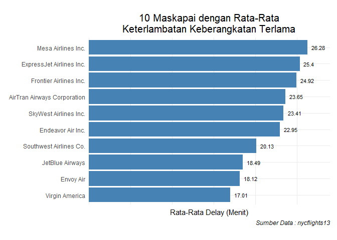
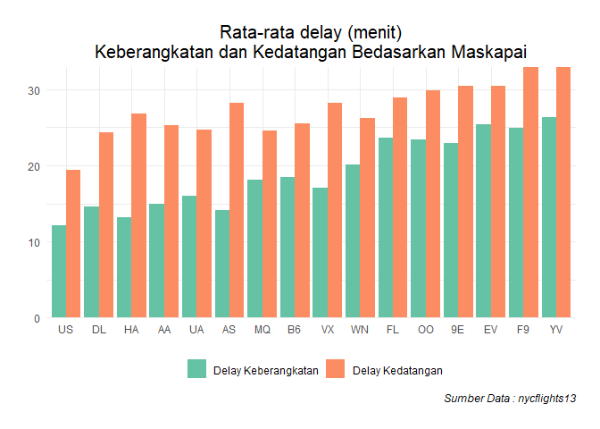
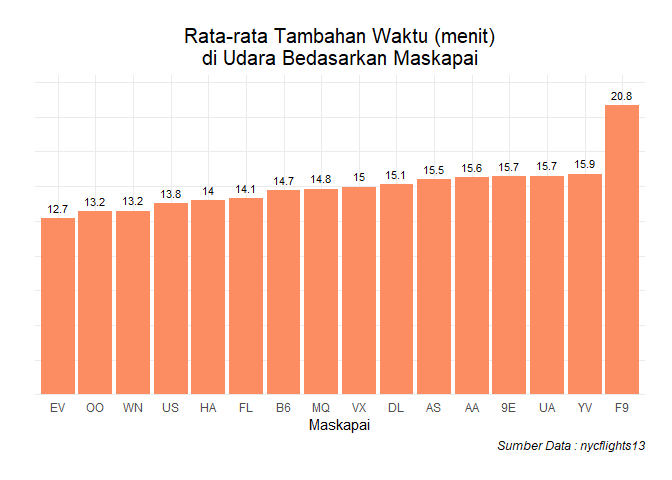
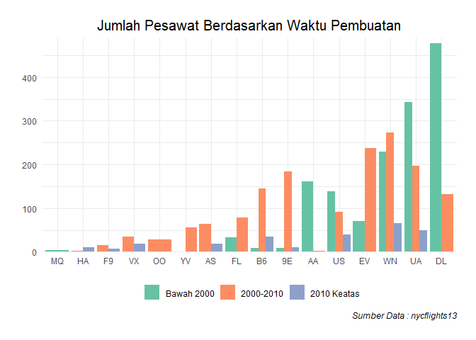

# Pembahasan UAS Tahun 2019/2020  

Load Library
============

``` r
library(ggplot2)
library(dplyr)
library(knitr)
library(nycflights13)
library(reshape2)
library(car)
```

Nomor 1
=======

Dari library(nycflights13), gunakan dataset flights, airports, airlines,
planes, dan weather.

Integrasi Data
--------------

### Data Flight

``` r
data <-  flights
kable(sample_n(data, 10))
```

<table>
<colgroup>
<col style="width: 2%" />
<col style="width: 3%" />
<col style="width: 2%" />
<col style="width: 5%" />
<col style="width: 8%" />
<col style="width: 5%" />
<col style="width: 5%" />
<col style="width: 8%" />
<col style="width: 5%" />
<col style="width: 4%" />
<col style="width: 4%" />
<col style="width: 4%" />
<col style="width: 4%" />
<col style="width: 2%" />
<col style="width: 5%" />
<col style="width: 5%" />
<col style="width: 2%" />
<col style="width: 4%" />
<col style="width: 11%" />
</colgroup>
<thead>
<tr class="header">
<th style="text-align: right;">year</th>
<th style="text-align: right;">month</th>
<th style="text-align: right;">day</th>
<th style="text-align: right;">dep_time</th>
<th style="text-align: right;">sched_dep_time</th>
<th style="text-align: right;">dep_delay</th>
<th style="text-align: right;">arr_time</th>
<th style="text-align: right;">sched_arr_time</th>
<th style="text-align: right;">arr_delay</th>
<th style="text-align: left;">carrier</th>
<th style="text-align: right;">flight</th>
<th style="text-align: left;">tailnum</th>
<th style="text-align: left;">origin</th>
<th style="text-align: left;">dest</th>
<th style="text-align: right;">air_time</th>
<th style="text-align: right;">distance</th>
<th style="text-align: right;">hour</th>
<th style="text-align: right;">minute</th>
<th style="text-align: left;">time_hour</th>
</tr>
</thead>
<tbody>
<tr class="odd">
<td style="text-align: right;">2013</td>
<td style="text-align: right;">5</td>
<td style="text-align: right;">29</td>
<td style="text-align: right;">753</td>
<td style="text-align: right;">759</td>
<td style="text-align: right;">-6</td>
<td style="text-align: right;">942</td>
<td style="text-align: right;">1020</td>
<td style="text-align: right;">-38</td>
<td style="text-align: left;">EV</td>
<td style="text-align: right;">4991</td>
<td style="text-align: left;">N722EV</td>
<td style="text-align: left;">LGA</td>
<td style="text-align: left;">MCI</td>
<td style="text-align: right;">144</td>
<td style="text-align: right;">1107</td>
<td style="text-align: right;">7</td>
<td style="text-align: right;">59</td>
<td style="text-align: left;">2013-05-29 07:00:00</td>
</tr>
<tr class="even">
<td style="text-align: right;">2013</td>
<td style="text-align: right;">1</td>
<td style="text-align: right;">13</td>
<td style="text-align: right;">1737</td>
<td style="text-align: right;">1550</td>
<td style="text-align: right;">107</td>
<td style="text-align: right;">1901</td>
<td style="text-align: right;">1710</td>
<td style="text-align: right;">111</td>
<td style="text-align: left;">WN</td>
<td style="text-align: right;">4215</td>
<td style="text-align: left;">N769SW</td>
<td style="text-align: left;">EWR</td>
<td style="text-align: left;">MDW</td>
<td style="text-align: right;">120</td>
<td style="text-align: right;">711</td>
<td style="text-align: right;">15</td>
<td style="text-align: right;">50</td>
<td style="text-align: left;">2013-01-13 15:00:00</td>
</tr>
<tr class="odd">
<td style="text-align: right;">2013</td>
<td style="text-align: right;">9</td>
<td style="text-align: right;">6</td>
<td style="text-align: right;">2044</td>
<td style="text-align: right;">2005</td>
<td style="text-align: right;">39</td>
<td style="text-align: right;">2148</td>
<td style="text-align: right;">2130</td>
<td style="text-align: right;">18</td>
<td style="text-align: left;">MQ</td>
<td style="text-align: right;">3604</td>
<td style="text-align: left;">N518MQ</td>
<td style="text-align: left;">EWR</td>
<td style="text-align: left;">ORD</td>
<td style="text-align: right;">99</td>
<td style="text-align: right;">719</td>
<td style="text-align: right;">20</td>
<td style="text-align: right;">5</td>
<td style="text-align: left;">2013-09-06 20:00:00</td>
</tr>
<tr class="even">
<td style="text-align: right;">2013</td>
<td style="text-align: right;">1</td>
<td style="text-align: right;">29</td>
<td style="text-align: right;">1150</td>
<td style="text-align: right;">1200</td>
<td style="text-align: right;">-10</td>
<td style="text-align: right;">1303</td>
<td style="text-align: right;">1309</td>
<td style="text-align: right;">-6</td>
<td style="text-align: left;">US</td>
<td style="text-align: right;">2173</td>
<td style="text-align: left;">N705UW</td>
<td style="text-align: left;">LGA</td>
<td style="text-align: left;">DCA</td>
<td style="text-align: right;">47</td>
<td style="text-align: right;">214</td>
<td style="text-align: right;">12</td>
<td style="text-align: right;">0</td>
<td style="text-align: left;">2013-01-29 12:00:00</td>
</tr>
<tr class="odd">
<td style="text-align: right;">2013</td>
<td style="text-align: right;">6</td>
<td style="text-align: right;">2</td>
<td style="text-align: right;">654</td>
<td style="text-align: right;">700</td>
<td style="text-align: right;">-6</td>
<td style="text-align: right;">807</td>
<td style="text-align: right;">830</td>
<td style="text-align: right;">-23</td>
<td style="text-align: left;">UA</td>
<td style="text-align: right;">1603</td>
<td style="text-align: left;">N77258</td>
<td style="text-align: left;">LGA</td>
<td style="text-align: left;">ORD</td>
<td style="text-align: right;">115</td>
<td style="text-align: right;">733</td>
<td style="text-align: right;">7</td>
<td style="text-align: right;">0</td>
<td style="text-align: left;">2013-06-02 07:00:00</td>
</tr>
<tr class="even">
<td style="text-align: right;">2013</td>
<td style="text-align: right;">4</td>
<td style="text-align: right;">30</td>
<td style="text-align: right;">1930</td>
<td style="text-align: right;">1855</td>
<td style="text-align: right;">35</td>
<td style="text-align: right;">2057</td>
<td style="text-align: right;">2037</td>
<td style="text-align: right;">20</td>
<td style="text-align: left;">EV</td>
<td style="text-align: right;">5222</td>
<td style="text-align: left;">N719EV</td>
<td style="text-align: left;">LGA</td>
<td style="text-align: left;">BGR</td>
<td style="text-align: right;">56</td>
<td style="text-align: right;">378</td>
<td style="text-align: right;">18</td>
<td style="text-align: right;">55</td>
<td style="text-align: left;">2013-04-30 18:00:00</td>
</tr>
<tr class="odd">
<td style="text-align: right;">2013</td>
<td style="text-align: right;">11</td>
<td style="text-align: right;">5</td>
<td style="text-align: right;">1052</td>
<td style="text-align: right;">1059</td>
<td style="text-align: right;">-7</td>
<td style="text-align: right;">1218</td>
<td style="text-align: right;">1230</td>
<td style="text-align: right;">-12</td>
<td style="text-align: left;">UA</td>
<td style="text-align: right;">775</td>
<td style="text-align: left;">N835UA</td>
<td style="text-align: left;">EWR</td>
<td style="text-align: left;">ORD</td>
<td style="text-align: right;">124</td>
<td style="text-align: right;">719</td>
<td style="text-align: right;">10</td>
<td style="text-align: right;">59</td>
<td style="text-align: left;">2013-11-05 10:00:00</td>
</tr>
<tr class="even">
<td style="text-align: right;">2013</td>
<td style="text-align: right;">8</td>
<td style="text-align: right;">24</td>
<td style="text-align: right;">1022</td>
<td style="text-align: right;">1025</td>
<td style="text-align: right;">-3</td>
<td style="text-align: right;">1302</td>
<td style="text-align: right;">1308</td>
<td style="text-align: right;">-6</td>
<td style="text-align: left;">B6</td>
<td style="text-align: right;">925</td>
<td style="text-align: left;">N585JB</td>
<td style="text-align: left;">JFK</td>
<td style="text-align: left;">TPA</td>
<td style="text-align: right;">134</td>
<td style="text-align: right;">1005</td>
<td style="text-align: right;">10</td>
<td style="text-align: right;">25</td>
<td style="text-align: left;">2013-08-24 10:00:00</td>
</tr>
<tr class="odd">
<td style="text-align: right;">2013</td>
<td style="text-align: right;">5</td>
<td style="text-align: right;">8</td>
<td style="text-align: right;">12</td>
<td style="text-align: right;">2025</td>
<td style="text-align: right;">227</td>
<td style="text-align: right;">241</td>
<td style="text-align: right;">2333</td>
<td style="text-align: right;">188</td>
<td style="text-align: left;">UA</td>
<td style="text-align: right;">771</td>
<td style="text-align: left;">N518UA</td>
<td style="text-align: left;">JFK</td>
<td style="text-align: left;">LAX</td>
<td style="text-align: right;">308</td>
<td style="text-align: right;">2475</td>
<td style="text-align: right;">20</td>
<td style="text-align: right;">25</td>
<td style="text-align: left;">2013-05-08 20:00:00</td>
</tr>
<tr class="even">
<td style="text-align: right;">2013</td>
<td style="text-align: right;">3</td>
<td style="text-align: right;">21</td>
<td style="text-align: right;">910</td>
<td style="text-align: right;">914</td>
<td style="text-align: right;">-4</td>
<td style="text-align: right;">1233</td>
<td style="text-align: right;">1206</td>
<td style="text-align: right;">27</td>
<td style="text-align: left;">B6</td>
<td style="text-align: right;">883</td>
<td style="text-align: left;">N645JB</td>
<td style="text-align: left;">JFK</td>
<td style="text-align: left;">MCO</td>
<td style="text-align: right;">142</td>
<td style="text-align: right;">944</td>
<td style="text-align: right;">9</td>
<td style="text-align: right;">14</td>
<td style="text-align: left;">2013-03-21 09:00:00</td>
</tr>
</tbody>
</table>

### Join Data Airlines

Untuk mengambil nama airlines

``` r
kable(head(airlines, 5))
```

| carrier | name                   |
|:--------|:-----------------------|
| 9E      | Endeavor Air Inc.      |
| AA      | American Airlines Inc. |
| AS      | Alaska Airlines Inc.   |
| B6      | JetBlue Airways        |
| DL      | Delta Air Lines Inc.   |

``` r
data <- left_join(data, airlines, by = "carrier")
kable(head(data, 10))
```

<table>
<colgroup>
<col style="width: 2%" />
<col style="width: 3%" />
<col style="width: 2%" />
<col style="width: 4%" />
<col style="width: 7%" />
<col style="width: 5%" />
<col style="width: 4%" />
<col style="width: 7%" />
<col style="width: 5%" />
<col style="width: 4%" />
<col style="width: 3%" />
<col style="width: 4%" />
<col style="width: 3%" />
<col style="width: 2%" />
<col style="width: 4%" />
<col style="width: 4%" />
<col style="width: 2%" />
<col style="width: 3%" />
<col style="width: 10%" />
<col style="width: 12%" />
</colgroup>
<thead>
<tr class="header">
<th style="text-align: right;">year</th>
<th style="text-align: right;">month</th>
<th style="text-align: right;">day</th>
<th style="text-align: right;">dep_time</th>
<th style="text-align: right;">sched_dep_time</th>
<th style="text-align: right;">dep_delay</th>
<th style="text-align: right;">arr_time</th>
<th style="text-align: right;">sched_arr_time</th>
<th style="text-align: right;">arr_delay</th>
<th style="text-align: left;">carrier</th>
<th style="text-align: right;">flight</th>
<th style="text-align: left;">tailnum</th>
<th style="text-align: left;">origin</th>
<th style="text-align: left;">dest</th>
<th style="text-align: right;">air_time</th>
<th style="text-align: right;">distance</th>
<th style="text-align: right;">hour</th>
<th style="text-align: right;">minute</th>
<th style="text-align: left;">time_hour</th>
<th style="text-align: left;">name</th>
</tr>
</thead>
<tbody>
<tr class="odd">
<td style="text-align: right;">2013</td>
<td style="text-align: right;">1</td>
<td style="text-align: right;">1</td>
<td style="text-align: right;">517</td>
<td style="text-align: right;">515</td>
<td style="text-align: right;">2</td>
<td style="text-align: right;">830</td>
<td style="text-align: right;">819</td>
<td style="text-align: right;">11</td>
<td style="text-align: left;">UA</td>
<td style="text-align: right;">1545</td>
<td style="text-align: left;">N14228</td>
<td style="text-align: left;">EWR</td>
<td style="text-align: left;">IAH</td>
<td style="text-align: right;">227</td>
<td style="text-align: right;">1400</td>
<td style="text-align: right;">5</td>
<td style="text-align: right;">15</td>
<td style="text-align: left;">2013-01-01 05:00:00</td>
<td style="text-align: left;">United Air Lines Inc.</td>
</tr>
<tr class="even">
<td style="text-align: right;">2013</td>
<td style="text-align: right;">1</td>
<td style="text-align: right;">1</td>
<td style="text-align: right;">533</td>
<td style="text-align: right;">529</td>
<td style="text-align: right;">4</td>
<td style="text-align: right;">850</td>
<td style="text-align: right;">830</td>
<td style="text-align: right;">20</td>
<td style="text-align: left;">UA</td>
<td style="text-align: right;">1714</td>
<td style="text-align: left;">N24211</td>
<td style="text-align: left;">LGA</td>
<td style="text-align: left;">IAH</td>
<td style="text-align: right;">227</td>
<td style="text-align: right;">1416</td>
<td style="text-align: right;">5</td>
<td style="text-align: right;">29</td>
<td style="text-align: left;">2013-01-01 05:00:00</td>
<td style="text-align: left;">United Air Lines Inc.</td>
</tr>
<tr class="odd">
<td style="text-align: right;">2013</td>
<td style="text-align: right;">1</td>
<td style="text-align: right;">1</td>
<td style="text-align: right;">542</td>
<td style="text-align: right;">540</td>
<td style="text-align: right;">2</td>
<td style="text-align: right;">923</td>
<td style="text-align: right;">850</td>
<td style="text-align: right;">33</td>
<td style="text-align: left;">AA</td>
<td style="text-align: right;">1141</td>
<td style="text-align: left;">N619AA</td>
<td style="text-align: left;">JFK</td>
<td style="text-align: left;">MIA</td>
<td style="text-align: right;">160</td>
<td style="text-align: right;">1089</td>
<td style="text-align: right;">5</td>
<td style="text-align: right;">40</td>
<td style="text-align: left;">2013-01-01 05:00:00</td>
<td style="text-align: left;">American Airlines Inc.</td>
</tr>
<tr class="even">
<td style="text-align: right;">2013</td>
<td style="text-align: right;">1</td>
<td style="text-align: right;">1</td>
<td style="text-align: right;">544</td>
<td style="text-align: right;">545</td>
<td style="text-align: right;">-1</td>
<td style="text-align: right;">1004</td>
<td style="text-align: right;">1022</td>
<td style="text-align: right;">-18</td>
<td style="text-align: left;">B6</td>
<td style="text-align: right;">725</td>
<td style="text-align: left;">N804JB</td>
<td style="text-align: left;">JFK</td>
<td style="text-align: left;">BQN</td>
<td style="text-align: right;">183</td>
<td style="text-align: right;">1576</td>
<td style="text-align: right;">5</td>
<td style="text-align: right;">45</td>
<td style="text-align: left;">2013-01-01 05:00:00</td>
<td style="text-align: left;">JetBlue Airways</td>
</tr>
<tr class="odd">
<td style="text-align: right;">2013</td>
<td style="text-align: right;">1</td>
<td style="text-align: right;">1</td>
<td style="text-align: right;">554</td>
<td style="text-align: right;">600</td>
<td style="text-align: right;">-6</td>
<td style="text-align: right;">812</td>
<td style="text-align: right;">837</td>
<td style="text-align: right;">-25</td>
<td style="text-align: left;">DL</td>
<td style="text-align: right;">461</td>
<td style="text-align: left;">N668DN</td>
<td style="text-align: left;">LGA</td>
<td style="text-align: left;">ATL</td>
<td style="text-align: right;">116</td>
<td style="text-align: right;">762</td>
<td style="text-align: right;">6</td>
<td style="text-align: right;">0</td>
<td style="text-align: left;">2013-01-01 06:00:00</td>
<td style="text-align: left;">Delta Air Lines Inc.</td>
</tr>
<tr class="even">
<td style="text-align: right;">2013</td>
<td style="text-align: right;">1</td>
<td style="text-align: right;">1</td>
<td style="text-align: right;">554</td>
<td style="text-align: right;">558</td>
<td style="text-align: right;">-4</td>
<td style="text-align: right;">740</td>
<td style="text-align: right;">728</td>
<td style="text-align: right;">12</td>
<td style="text-align: left;">UA</td>
<td style="text-align: right;">1696</td>
<td style="text-align: left;">N39463</td>
<td style="text-align: left;">EWR</td>
<td style="text-align: left;">ORD</td>
<td style="text-align: right;">150</td>
<td style="text-align: right;">719</td>
<td style="text-align: right;">5</td>
<td style="text-align: right;">58</td>
<td style="text-align: left;">2013-01-01 05:00:00</td>
<td style="text-align: left;">United Air Lines Inc.</td>
</tr>
<tr class="odd">
<td style="text-align: right;">2013</td>
<td style="text-align: right;">1</td>
<td style="text-align: right;">1</td>
<td style="text-align: right;">555</td>
<td style="text-align: right;">600</td>
<td style="text-align: right;">-5</td>
<td style="text-align: right;">913</td>
<td style="text-align: right;">854</td>
<td style="text-align: right;">19</td>
<td style="text-align: left;">B6</td>
<td style="text-align: right;">507</td>
<td style="text-align: left;">N516JB</td>
<td style="text-align: left;">EWR</td>
<td style="text-align: left;">FLL</td>
<td style="text-align: right;">158</td>
<td style="text-align: right;">1065</td>
<td style="text-align: right;">6</td>
<td style="text-align: right;">0</td>
<td style="text-align: left;">2013-01-01 06:00:00</td>
<td style="text-align: left;">JetBlue Airways</td>
</tr>
<tr class="even">
<td style="text-align: right;">2013</td>
<td style="text-align: right;">1</td>
<td style="text-align: right;">1</td>
<td style="text-align: right;">557</td>
<td style="text-align: right;">600</td>
<td style="text-align: right;">-3</td>
<td style="text-align: right;">709</td>
<td style="text-align: right;">723</td>
<td style="text-align: right;">-14</td>
<td style="text-align: left;">EV</td>
<td style="text-align: right;">5708</td>
<td style="text-align: left;">N829AS</td>
<td style="text-align: left;">LGA</td>
<td style="text-align: left;">IAD</td>
<td style="text-align: right;">53</td>
<td style="text-align: right;">229</td>
<td style="text-align: right;">6</td>
<td style="text-align: right;">0</td>
<td style="text-align: left;">2013-01-01 06:00:00</td>
<td style="text-align: left;">ExpressJet Airlines Inc.</td>
</tr>
<tr class="odd">
<td style="text-align: right;">2013</td>
<td style="text-align: right;">1</td>
<td style="text-align: right;">1</td>
<td style="text-align: right;">557</td>
<td style="text-align: right;">600</td>
<td style="text-align: right;">-3</td>
<td style="text-align: right;">838</td>
<td style="text-align: right;">846</td>
<td style="text-align: right;">-8</td>
<td style="text-align: left;">B6</td>
<td style="text-align: right;">79</td>
<td style="text-align: left;">N593JB</td>
<td style="text-align: left;">JFK</td>
<td style="text-align: left;">MCO</td>
<td style="text-align: right;">140</td>
<td style="text-align: right;">944</td>
<td style="text-align: right;">6</td>
<td style="text-align: right;">0</td>
<td style="text-align: left;">2013-01-01 06:00:00</td>
<td style="text-align: left;">JetBlue Airways</td>
</tr>
<tr class="even">
<td style="text-align: right;">2013</td>
<td style="text-align: right;">1</td>
<td style="text-align: right;">1</td>
<td style="text-align: right;">558</td>
<td style="text-align: right;">600</td>
<td style="text-align: right;">-2</td>
<td style="text-align: right;">753</td>
<td style="text-align: right;">745</td>
<td style="text-align: right;">8</td>
<td style="text-align: left;">AA</td>
<td style="text-align: right;">301</td>
<td style="text-align: left;">N3ALAA</td>
<td style="text-align: left;">LGA</td>
<td style="text-align: left;">ORD</td>
<td style="text-align: right;">138</td>
<td style="text-align: right;">733</td>
<td style="text-align: right;">6</td>
<td style="text-align: right;">0</td>
<td style="text-align: left;">2013-01-01 06:00:00</td>
<td style="text-align: left;">American Airlines Inc.</td>
</tr>
</tbody>
</table>

### Join Data Planes

Untuk mengambil tahun pembuatan pesawat

``` r
kable(sample_n(planes, 7))
```

<table style="width:100%;">
<colgroup>
<col style="width: 7%" />
<col style="width: 4%" />
<col style="width: 23%" />
<col style="width: 17%" />
<col style="width: 14%" />
<col style="width: 7%" />
<col style="width: 5%" />
<col style="width: 5%" />
<col style="width: 9%" />
</colgroup>
<thead>
<tr class="header">
<th style="text-align: left;">tailnum</th>
<th style="text-align: right;">year</th>
<th style="text-align: left;">type</th>
<th style="text-align: left;">manufacturer</th>
<th style="text-align: left;">model</th>
<th style="text-align: right;">engines</th>
<th style="text-align: right;">seats</th>
<th style="text-align: right;">speed</th>
<th style="text-align: left;">engine</th>
</tr>
</thead>
<tbody>
<tr class="odd">
<td style="text-align: left;">N936AT</td>
<td style="text-align: right;">1999</td>
<td style="text-align: left;">Fixed wing multi engine</td>
<td style="text-align: left;">BOEING</td>
<td style="text-align: left;">717-200</td>
<td style="text-align: right;">2</td>
<td style="text-align: right;">100</td>
<td style="text-align: right;">NA</td>
<td style="text-align: left;">Turbo-fan</td>
</tr>
<tr class="even">
<td style="text-align: left;">N561AA</td>
<td style="text-align: right;">1991</td>
<td style="text-align: left;">Fixed wing multi engine</td>
<td style="text-align: left;">MCDONNELL DOUGLAS</td>
<td style="text-align: left;">DC-9-82(MD-82)</td>
<td style="text-align: right;">2</td>
<td style="text-align: right;">172</td>
<td style="text-align: right;">NA</td>
<td style="text-align: left;">Turbo-fan</td>
</tr>
<tr class="odd">
<td style="text-align: left;">N557AS</td>
<td style="text-align: right;">2006</td>
<td style="text-align: left;">Fixed wing multi engine</td>
<td style="text-align: left;">BOEING</td>
<td style="text-align: left;">737-890</td>
<td style="text-align: right;">2</td>
<td style="text-align: right;">149</td>
<td style="text-align: right;">NA</td>
<td style="text-align: left;">Turbo-fan</td>
</tr>
<tr class="even">
<td style="text-align: left;">N18114</td>
<td style="text-align: right;">2002</td>
<td style="text-align: left;">Fixed wing multi engine</td>
<td style="text-align: left;">EMBRAER</td>
<td style="text-align: left;">EMB-145XR</td>
<td style="text-align: right;">2</td>
<td style="text-align: right;">55</td>
<td style="text-align: right;">NA</td>
<td style="text-align: left;">Turbo-fan</td>
</tr>
<tr class="odd">
<td style="text-align: left;">N761RR</td>
<td style="text-align: right;">2000</td>
<td style="text-align: left;">Fixed wing multi engine</td>
<td style="text-align: left;">BOEING</td>
<td style="text-align: left;">737-7H4</td>
<td style="text-align: right;">2</td>
<td style="text-align: right;">140</td>
<td style="text-align: right;">NA</td>
<td style="text-align: left;">Turbo-fan</td>
</tr>
<tr class="even">
<td style="text-align: left;">N1604R</td>
<td style="text-align: right;">1999</td>
<td style="text-align: left;">Fixed wing multi engine</td>
<td style="text-align: left;">BOEING</td>
<td style="text-align: left;">767-332</td>
<td style="text-align: right;">2</td>
<td style="text-align: right;">330</td>
<td style="text-align: right;">NA</td>
<td style="text-align: left;">Turbo-fan</td>
</tr>
<tr class="odd">
<td style="text-align: left;">N603JB</td>
<td style="text-align: right;">2005</td>
<td style="text-align: left;">Fixed wing multi engine</td>
<td style="text-align: left;">AIRBUS</td>
<td style="text-align: left;">A320-232</td>
<td style="text-align: right;">2</td>
<td style="text-align: right;">200</td>
<td style="text-align: right;">NA</td>
<td style="text-align: left;">Turbo-fan</td>
</tr>
</tbody>
</table>

``` r
tmp <- planes %>%
      select(tailnum, year) %>%
      rename(year_manufacture = year)

data <- left_join(data, tmp, by = "tailnum")
kable(head(data, 10))
```

<table>
<colgroup>
<col style="width: 2%" />
<col style="width: 2%" />
<col style="width: 1%" />
<col style="width: 4%" />
<col style="width: 7%" />
<col style="width: 4%" />
<col style="width: 4%" />
<col style="width: 7%" />
<col style="width: 4%" />
<col style="width: 3%" />
<col style="width: 3%" />
<col style="width: 3%" />
<col style="width: 3%" />
<col style="width: 2%" />
<col style="width: 4%" />
<col style="width: 4%" />
<col style="width: 2%" />
<col style="width: 3%" />
<col style="width: 9%" />
<col style="width: 11%" />
<col style="width: 8%" />
</colgroup>
<thead>
<tr class="header">
<th style="text-align: right;">year</th>
<th style="text-align: right;">month</th>
<th style="text-align: right;">day</th>
<th style="text-align: right;">dep_time</th>
<th style="text-align: right;">sched_dep_time</th>
<th style="text-align: right;">dep_delay</th>
<th style="text-align: right;">arr_time</th>
<th style="text-align: right;">sched_arr_time</th>
<th style="text-align: right;">arr_delay</th>
<th style="text-align: left;">carrier</th>
<th style="text-align: right;">flight</th>
<th style="text-align: left;">tailnum</th>
<th style="text-align: left;">origin</th>
<th style="text-align: left;">dest</th>
<th style="text-align: right;">air_time</th>
<th style="text-align: right;">distance</th>
<th style="text-align: right;">hour</th>
<th style="text-align: right;">minute</th>
<th style="text-align: left;">time_hour</th>
<th style="text-align: left;">name</th>
<th style="text-align: right;">year_manufacture</th>
</tr>
</thead>
<tbody>
<tr class="odd">
<td style="text-align: right;">2013</td>
<td style="text-align: right;">1</td>
<td style="text-align: right;">1</td>
<td style="text-align: right;">517</td>
<td style="text-align: right;">515</td>
<td style="text-align: right;">2</td>
<td style="text-align: right;">830</td>
<td style="text-align: right;">819</td>
<td style="text-align: right;">11</td>
<td style="text-align: left;">UA</td>
<td style="text-align: right;">1545</td>
<td style="text-align: left;">N14228</td>
<td style="text-align: left;">EWR</td>
<td style="text-align: left;">IAH</td>
<td style="text-align: right;">227</td>
<td style="text-align: right;">1400</td>
<td style="text-align: right;">5</td>
<td style="text-align: right;">15</td>
<td style="text-align: left;">2013-01-01 05:00:00</td>
<td style="text-align: left;">United Air Lines Inc.</td>
<td style="text-align: right;">1999</td>
</tr>
<tr class="even">
<td style="text-align: right;">2013</td>
<td style="text-align: right;">1</td>
<td style="text-align: right;">1</td>
<td style="text-align: right;">533</td>
<td style="text-align: right;">529</td>
<td style="text-align: right;">4</td>
<td style="text-align: right;">850</td>
<td style="text-align: right;">830</td>
<td style="text-align: right;">20</td>
<td style="text-align: left;">UA</td>
<td style="text-align: right;">1714</td>
<td style="text-align: left;">N24211</td>
<td style="text-align: left;">LGA</td>
<td style="text-align: left;">IAH</td>
<td style="text-align: right;">227</td>
<td style="text-align: right;">1416</td>
<td style="text-align: right;">5</td>
<td style="text-align: right;">29</td>
<td style="text-align: left;">2013-01-01 05:00:00</td>
<td style="text-align: left;">United Air Lines Inc.</td>
<td style="text-align: right;">1998</td>
</tr>
<tr class="odd">
<td style="text-align: right;">2013</td>
<td style="text-align: right;">1</td>
<td style="text-align: right;">1</td>
<td style="text-align: right;">542</td>
<td style="text-align: right;">540</td>
<td style="text-align: right;">2</td>
<td style="text-align: right;">923</td>
<td style="text-align: right;">850</td>
<td style="text-align: right;">33</td>
<td style="text-align: left;">AA</td>
<td style="text-align: right;">1141</td>
<td style="text-align: left;">N619AA</td>
<td style="text-align: left;">JFK</td>
<td style="text-align: left;">MIA</td>
<td style="text-align: right;">160</td>
<td style="text-align: right;">1089</td>
<td style="text-align: right;">5</td>
<td style="text-align: right;">40</td>
<td style="text-align: left;">2013-01-01 05:00:00</td>
<td style="text-align: left;">American Airlines Inc.</td>
<td style="text-align: right;">1990</td>
</tr>
<tr class="even">
<td style="text-align: right;">2013</td>
<td style="text-align: right;">1</td>
<td style="text-align: right;">1</td>
<td style="text-align: right;">544</td>
<td style="text-align: right;">545</td>
<td style="text-align: right;">-1</td>
<td style="text-align: right;">1004</td>
<td style="text-align: right;">1022</td>
<td style="text-align: right;">-18</td>
<td style="text-align: left;">B6</td>
<td style="text-align: right;">725</td>
<td style="text-align: left;">N804JB</td>
<td style="text-align: left;">JFK</td>
<td style="text-align: left;">BQN</td>
<td style="text-align: right;">183</td>
<td style="text-align: right;">1576</td>
<td style="text-align: right;">5</td>
<td style="text-align: right;">45</td>
<td style="text-align: left;">2013-01-01 05:00:00</td>
<td style="text-align: left;">JetBlue Airways</td>
<td style="text-align: right;">2012</td>
</tr>
<tr class="odd">
<td style="text-align: right;">2013</td>
<td style="text-align: right;">1</td>
<td style="text-align: right;">1</td>
<td style="text-align: right;">554</td>
<td style="text-align: right;">600</td>
<td style="text-align: right;">-6</td>
<td style="text-align: right;">812</td>
<td style="text-align: right;">837</td>
<td style="text-align: right;">-25</td>
<td style="text-align: left;">DL</td>
<td style="text-align: right;">461</td>
<td style="text-align: left;">N668DN</td>
<td style="text-align: left;">LGA</td>
<td style="text-align: left;">ATL</td>
<td style="text-align: right;">116</td>
<td style="text-align: right;">762</td>
<td style="text-align: right;">6</td>
<td style="text-align: right;">0</td>
<td style="text-align: left;">2013-01-01 06:00:00</td>
<td style="text-align: left;">Delta Air Lines Inc.</td>
<td style="text-align: right;">1991</td>
</tr>
<tr class="even">
<td style="text-align: right;">2013</td>
<td style="text-align: right;">1</td>
<td style="text-align: right;">1</td>
<td style="text-align: right;">554</td>
<td style="text-align: right;">558</td>
<td style="text-align: right;">-4</td>
<td style="text-align: right;">740</td>
<td style="text-align: right;">728</td>
<td style="text-align: right;">12</td>
<td style="text-align: left;">UA</td>
<td style="text-align: right;">1696</td>
<td style="text-align: left;">N39463</td>
<td style="text-align: left;">EWR</td>
<td style="text-align: left;">ORD</td>
<td style="text-align: right;">150</td>
<td style="text-align: right;">719</td>
<td style="text-align: right;">5</td>
<td style="text-align: right;">58</td>
<td style="text-align: left;">2013-01-01 05:00:00</td>
<td style="text-align: left;">United Air Lines Inc.</td>
<td style="text-align: right;">2012</td>
</tr>
<tr class="odd">
<td style="text-align: right;">2013</td>
<td style="text-align: right;">1</td>
<td style="text-align: right;">1</td>
<td style="text-align: right;">555</td>
<td style="text-align: right;">600</td>
<td style="text-align: right;">-5</td>
<td style="text-align: right;">913</td>
<td style="text-align: right;">854</td>
<td style="text-align: right;">19</td>
<td style="text-align: left;">B6</td>
<td style="text-align: right;">507</td>
<td style="text-align: left;">N516JB</td>
<td style="text-align: left;">EWR</td>
<td style="text-align: left;">FLL</td>
<td style="text-align: right;">158</td>
<td style="text-align: right;">1065</td>
<td style="text-align: right;">6</td>
<td style="text-align: right;">0</td>
<td style="text-align: left;">2013-01-01 06:00:00</td>
<td style="text-align: left;">JetBlue Airways</td>
<td style="text-align: right;">2000</td>
</tr>
<tr class="even">
<td style="text-align: right;">2013</td>
<td style="text-align: right;">1</td>
<td style="text-align: right;">1</td>
<td style="text-align: right;">557</td>
<td style="text-align: right;">600</td>
<td style="text-align: right;">-3</td>
<td style="text-align: right;">709</td>
<td style="text-align: right;">723</td>
<td style="text-align: right;">-14</td>
<td style="text-align: left;">EV</td>
<td style="text-align: right;">5708</td>
<td style="text-align: left;">N829AS</td>
<td style="text-align: left;">LGA</td>
<td style="text-align: left;">IAD</td>
<td style="text-align: right;">53</td>
<td style="text-align: right;">229</td>
<td style="text-align: right;">6</td>
<td style="text-align: right;">0</td>
<td style="text-align: left;">2013-01-01 06:00:00</td>
<td style="text-align: left;">ExpressJet Airlines Inc.</td>
<td style="text-align: right;">1998</td>
</tr>
<tr class="odd">
<td style="text-align: right;">2013</td>
<td style="text-align: right;">1</td>
<td style="text-align: right;">1</td>
<td style="text-align: right;">557</td>
<td style="text-align: right;">600</td>
<td style="text-align: right;">-3</td>
<td style="text-align: right;">838</td>
<td style="text-align: right;">846</td>
<td style="text-align: right;">-8</td>
<td style="text-align: left;">B6</td>
<td style="text-align: right;">79</td>
<td style="text-align: left;">N593JB</td>
<td style="text-align: left;">JFK</td>
<td style="text-align: left;">MCO</td>
<td style="text-align: right;">140</td>
<td style="text-align: right;">944</td>
<td style="text-align: right;">6</td>
<td style="text-align: right;">0</td>
<td style="text-align: left;">2013-01-01 06:00:00</td>
<td style="text-align: left;">JetBlue Airways</td>
<td style="text-align: right;">2004</td>
</tr>
<tr class="even">
<td style="text-align: right;">2013</td>
<td style="text-align: right;">1</td>
<td style="text-align: right;">1</td>
<td style="text-align: right;">558</td>
<td style="text-align: right;">600</td>
<td style="text-align: right;">-2</td>
<td style="text-align: right;">753</td>
<td style="text-align: right;">745</td>
<td style="text-align: right;">8</td>
<td style="text-align: left;">AA</td>
<td style="text-align: right;">301</td>
<td style="text-align: left;">N3ALAA</td>
<td style="text-align: left;">LGA</td>
<td style="text-align: left;">ORD</td>
<td style="text-align: right;">138</td>
<td style="text-align: right;">733</td>
<td style="text-align: right;">6</td>
<td style="text-align: right;">0</td>
<td style="text-align: left;">2013-01-01 06:00:00</td>
<td style="text-align: left;">American Airlines Inc.</td>
<td style="text-align: right;">NA</td>
</tr>
</tbody>
</table>

Bagian A
--------

Buat bar-chart untuk urutan 10 maskapai penerbangan airlines (lengkap
dengan nama maskapainya) dengan rata-rata waktu keterlambatan
keberangkatan (departure delay) paling lama

Variabel `dep_delay` mengandung nilai positif dan negatif. Nilai negatif
artinya bahwa pesawat berangkat lebih cepat dari jadwal keberangkatan,
sedangan jika nilainya positif pesawat lebih lambat dari jadwal
keberangkatan. Pada bar-chart yang akan dibuat, saya menggunakan
keduanya akan tetapi untuk nilai yang negatif saya mutlakkan terlebih
dahulu, agar tidak mempengaruhi rata-rata yang dibuat, karena menurut
saya keberangkatan yang lebih cepat juga tidak baik.

`Ket : ini tergantung kalian, mau tetap menggunakan nilai yang negatif atau tidak.`

``` r
my_caption <- expression(italic("Sumber Data : nycflights13"))
data %>%
      mutate(dep_delay = abs(dep_delay)) %>%
      group_by(name) %>%
      summarise(mean_delay = mean(dep_delay, na.rm = TRUE)) %>%
      top_n(10) %>%
      ggplot(aes(x = mean_delay, y = reorder(name, mean_delay))) +
      geom_col(fill = "steelblue") +
      labs(x = "Rata-Rata Delay (Menit)",
           y = "",
           title = "10 Maskapai dengan Rata-Rata\nKeterlambatan Keberangkatan Terlama",
           caption = my_caption) +
      scale_x_continuous(expand = c(0, 0), limit = c(0, 29)) +
      geom_text(aes(label = round(mean_delay, 2)), size = 3, hjust = -0.3) +
      theme_minimal() +
      theme(plot.title = element_text(hjust = 0.5, size = 15),
            axis.text.x = element_blank(),
            plot.margin = margin(20, 10, 20, 0))
```



Bagian B
--------

Uji apakah terdapat beda rata-rata jarak yang ditempuh dari pesawat yang
dibuat sebelum tahun 2000 dan setelah (termasuk) tahun 2000

### Split Data

``` r
sebelum2000 <- data %>%
      filter(year_manufacture < 2000) %>%
      pull(distance)
mean(sebelum2000)
```

    ## [1] 1282.4

``` r
sesudah2000 <- data %>%
      filter(year_manufacture >= 2000) %>%
      pull(distance)
mean(sesudah2000)
```

    ## [1] 977.9458

### Uji Kesamaan Varians

-   H0 : Varians keduanya sama
-   H1 : Varians keduanya tidak sama

``` r
var.test(sebelum2000, sesudah2000)
```

    ## 
    ##  F test to compare two variances
    ## 
    ## data:  sebelum2000 and sesudah2000
    ## F = 1.1262, num df = 86017, denom df = 192845, p-value < 2.2e-16
    ## alternative hypothesis: true ratio of variances is not equal to 1
    ## 95 percent confidence interval:
    ##  1.113478 1.139077
    ## sample estimates:
    ## ratio of variances 
    ##           1.126191

Karena p-value lebih kecil dari 0.05, maka tolak H0 dan dapat
diasumsikan varians tidak sama

### Uji Beda Rata-Rata

-   H0 : Rata-rata keduanya sama
-   H1 : Rata-rata keduanya berbeda

``` r
t.test(sebelum2000, sesudah2000, var.equal = FALSE)
```

    ## 
    ##  Welch Two Sample t-test
    ## 
    ## data:  sebelum2000 and sesudah2000
    ## t = 96.934, df = 156684, p-value < 2.2e-16
    ## alternative hypothesis: true difference in means is not equal to 0
    ## 95 percent confidence interval:
    ##  298.2984 310.6103
    ## sample estimates:
    ## mean of x mean of y 
    ## 1282.4002  977.9458

Karena p-value lebih kecil dari 0.05, maka tolak H0.

Degan tingkat signifikansi 5% diperoleh cukup bukti bahwa rata-rata
jarak yang ditempuh dari pesawat yang dibuat sebelum tahun 2000 dan
setelah (termasuk) tahun 2000. Jika dilihat pesawat dengan tahun
pembuatan 2000 kebawah memiliki jarak tempuh yang lebih besar yaitu
sebesar 1282.4 miles sedangkan pesawat yang dibuat tahun 2000 atau
keatas hanya sebesar 977.9458 miles

Bagian C
--------

Uji apakah terdapat beda rata-rata waktu keterlambatan keberangkatan
dari tiga musim (winter: oct-jan, spring: feb-may, summer: june-sept).
Lakukan uji lanjutan jika diperlukan.

### Konversi Bulan ke Musim

``` r
bulan_to_musim <- function(x){
      season <- NULL
      for(i in 1:length(x)){
            if (x[i] %in% c(10, 11, 12, 1))
                  season[i] <- "Winter"
            else if (x[i] %in% c(2, 3, 4, 5))
                  season[i] <- "Spring"
            else
                  season[i] <- "Summer"
      }
      season
}

newData <- data %>%
      select(month, dep_delay) %>%
      mutate(season = bulan_to_musim(month))
```

kable(sample\_n(newData, 10))

### Uji Kesamaan Varians

-   H0 : Semua katagori memiliki varians yang sama
-   H1 : Minimal ada satu katagori yang berbeda variansnya

``` r
leveneTest(dep_delay ~ factor(season), data = newData)
```

    ## Levene's Test for Homogeneity of Variance (center = median)
    ##           Df F value    Pr(>F)    
    ## group      2  573.13 < 2.2e-16 ***
    ##       328518                      
    ## ---
    ## Signif. codes:  0 '***' 0.001 '**' 0.01 '*' 0.05 '.' 0.1 ' ' 1

Terlihat bahwa p-value sangat kecil yang artinya varians berbeda. Maka
asumsi kesamaan tidak terpenuhi

Karena tidak memenuhi maka harus ke uji nonparametrik

### Uji Kruskal Wallis

-   H0 : Rata-rata delay diketiga musim tidak terdapat perbedaan
-   H0 : Minimal ada satu rata-rata delay yang berbeda

``` r
kruskal.test(dep_delay ~ factor(season), data = newData)
```

    ## 
    ##  Kruskal-Wallis rank sum test
    ## 
    ## data:  dep_delay by factor(season)
    ## Kruskal-Wallis chi-squared = 780.32, df = 2, p-value < 2.2e-16

Terlihat bahwa p-value yang diperoleh sangat kecil, oleh karena itu
tolak H0, yang berarti diperoleh cukup bukti bahwa ada perbedaan
rata-rata diketiga musim. Kita juga dapat menyimpulkan bahwa terdapat
pengaruh yang signifikan terhadap musim dan rata-rata delay
keberangkatan.

### Posthoc Test Nonparametrik

``` r
pairwise.wilcox.test(newData$dep_delay, newData$season, p.adjust.method = "BH")
```

    ## 
    ##  Pairwise comparisons using Wilcoxon rank sum test with continuity correction 
    ## 
    ## data:  newData$dep_delay and newData$season 
    ## 
    ##        Spring Summer
    ## Summer <2e-16 -     
    ## Winter <2e-16 <2e-16
    ## 
    ## P value adjustment method: BH

Terlihat bahwa p-value dari semuanya sangat kecil sehingga semua
pasangan memiliki rata-rata yang berbeda

### Menggunakan anova

Jika tetap memaksakan menggunakan Anova

-   H0 : Rata-rata delay diketiga musim tidak terdapat perbedaan
-   H0 : Minimal ada satu rata-rata delay yang berbeda

``` r
res.aov <- aov(dep_delay ~ season, data = newData)
summary(res.aov)
```

    ##                 Df    Sum Sq Mean Sq F value Pr(>F)    
    ## season           2   1985572  992786   616.3 <2e-16 ***
    ## Residuals   328518 529181660    1611                   
    ## ---
    ## Signif. codes:  0 '***' 0.001 '**' 0.01 '*' 0.05 '.' 0.1 ' ' 1
    ## 8255 observations deleted due to missingness

Terlihat bahwa p-value yang diperoleh sangat kecil, oleh karena itu
tolak H0, yang berarti diperoleh cukup bukti bahwa ada perbedaan
rata-rata diketiga musim. Kita juga dapat menyimpulkan bahwa terdapat
pengaruh yang signifikan terhadap musim dan rata-rata delay
keberangkatan.

### Posthoc Test Parametrik

Karena tolak H0, maka perlu digunakan analisis perbandingan ganda atau
posthoc tes untuk melihat rata-rata mana yang berbeda, kali ini akan
digunakan uji TukeyHSD

``` r
TukeyHSD(res.aov)
```

    ##   Tukey multiple comparisons of means
    ##     95% family-wise confidence level
    ## 
    ## Fit: aov(formula = dep_delay ~ season, data = newData)
    ## 
    ## $season
    ##                    diff       lwr       upr p adj
    ## Summer-Spring  2.698463  2.296606  3.100321     0
    ## Winter-Spring -3.289657 -3.693674 -2.885639     0
    ## Winter-Summer -5.988120 -6.388360 -5.587880     0

Terlihat bahwa semua pasang musim memiliki p-value adjusted yang sangat
kecil (tertulis 0 tapi sebenarnya bukan 0 banget). Oleh karena itu kita
dapat menyimpulakan rata-rata dari ketiga musim sangat berbeda secara
signifikan

``` r
tapply(newData$dep_delay, newData$season, mean, na.rm = TRUE)
```

    ##   Spring   Summer   Winter 
    ## 12.81601 15.51447  9.52635

Terlihat rata-rata yang paling lama pada musim summer sebesar 15.5 menit
sedangkan yang terendah pada winter yaitu 9.52 menit

Bagian D
--------

Berdasarkan data diatas, maskapai mana yang paling bagus kinerjanya
serta berikan alasannya

*Ket: Untuk menjawab soal ini kalian bisa melihat dari berbagai sisi,
sesuai dengan analisis masing-masing*

Untuk melihat kinerja dari maskapai saya akan menggunakan 2 indikator

### Indikator Pertama

Indikator pertama adalah ketepatan keberangkatan dan kedatangan sesuai
dengan jadwal

``` r
my_caption <- expression(italic("Sumber Data : nycflights13"))
data %>% 
      mutate(dep_delay = abs(dep_delay),
             arr_delay = abs(arr_delay)) %>%
      select(dep_delay, arr_delay, carrier, name) %>%
      group_by(carrier) %>%
      summarise(mean_dep_delay = mean(dep_delay, na.rm = TRUE),
                mean_arr_delay = mean(arr_delay, na.rm = TRUE)) %>%
      melt() %>%
      ggplot() +
      geom_col(aes(x = reorder(carrier, value), 
                   y = value, 
                   fill = variable), 
               position = "dodge") +
      labs(title = "Rata-rata delay (menit)\nKeberangkatan dan Kedatangan Bedasarkan Maskapai",
           fill = "",
           x = "", 
           y = "",
           caption = my_caption) +
      scale_y_continuous(expand = c(0, NA)) +
      scale_fill_brewer(labels = c("Delay Keberangkatan", "Delay Kedatangan"),
                        palette = "Set2") +
      theme_minimal() +
      theme(legend.position = "bottom",
            plot.title = element_text(hjust = 0.5, size = 15),
            plot.margin = margin(c(20,20,20,10)),
            legend.box.margin = margin(-10, 0, 0, 0))
```



Telihat berdasarkan indikator ini maskapai yang sering delay baik
keberangkatan maupun kedatangan adalah maskapai Mesa Airlines Inc. (YV)
Sementara itu maskapai yang sangat baik dalam indikator ini adalah
maskapai US Airways Inc (US).

### Indikator Kedua

Indikator kedua adalah kesesuaian lama diudara. Misalanya jika
keberangkatan delay 2 menit maka maksimal kedatangan juga maksimal delay
2 menit, jika lebih dari itu maka akan dianggap tidak wajar, karena
melebihi waktu penerbangan yang sesungguhnya.

``` r
my_caption <- expression(italic("Sumber Data : nycflights13"))
data %>%
      filter(arr_delay > dep_delay) %>%
      mutate(tambahan_diudara = arr_delay - dep_delay) %>%
      select(tambahan_diudara, carrier) %>%
      group_by(carrier) %>%
      summarise(jumlah = mean(tambahan_diudara, na.rm = TRUE)) %>%
      arrange(jumlah) %>%
      ggplot(aes(x = reorder(carrier, jumlah), 
                   y = jumlah)) +
      geom_col(fill = "#fc8d62") +
      geom_text(aes(label = round(jumlah, 1)), vjust = -0.7, size = 3) +
      labs(title = "Rata-rata Tambahan Waktu (menit)\ndi Udara Bedasarkan Maskapai",
           x = "Maskapai", 
           y = "",
           caption = my_caption) +
      scale_y_continuous(expand = c(0, NA), limits = c(0, 23)) +
      theme_minimal() +
      theme(legend.position = "bottom",
            plot.title = element_text(hjust = 0.5, size = 15),
            plot.margin = margin(c(20,20,20,10)),
            legend.box.margin = margin(-10, 0, 0, 0),
            axis.text.y = element_blank())
```



Dari gambar diatas terlihat bahwa rata-rata penambahan waktu di udara
yang terlama adalah maskapai Frontier Airlines Inc. (F9) dengan
rata-rata 20.8 menit. Sementara itu maskapai yang memiliki rata-rata
penambahan waktu paling sedikit adalah maskapai ExpressJet Airlines
Inc.(EV)

### Kesimpulan

Dari beberapa penjelasan diatas untuk menentukan carrier yang mempunyai
performa terbaik dapat dilihat dari carrier yang paling sesuai dengan
jadwal keberangkatan maupun kedatangan dan lama waktu di udara yang
sesuai. Dari hasil analisis diperoleh bahwa maskapai US Airways Inc yang
memiliki performa terbaik karena pada indikator satu menduduki peringkat
pertama dan indikator dua memduduki urutan ke 4.

### Tambahan

Selain itu, untuk masyarakat dapat menghindari pemakaian jasa maskapai
dengan melihat jenis pesawat yang digunakan oleh maskapai tersebut,
terutama dari segi waktu pembuatan pesawat tersebut.

``` r
tmp <- data %>%
      distinct(tailnum, carrier, .keep_all = TRUE) %>%
      select(year_manufacture, carrier) %>%
      na.omit()

tmp$year_manufacture <- cut(tmp$year_manufacture, 
                        breaks = c(1940, 2000, 2010, 2020),
                        labels = c("Bawah 2000", "2000-2010", "2010 Keatas"))

my_caption <- expression(italic("Sumber Data : nycflights13"))
tmp %>%
      group_by(carrier, year_manufacture) %>%
      summarise(jumlah = n()) %>%
      ggplot(aes(x = reorder(carrier, jumlah), y = jumlah, fill = year_manufacture)) +
      geom_col(position = "dodge") +
      labs(title = "Jumlah Pesawat Berdasarkan Waktu Pembuatan",
           fill = "",
           x = "", 
           y = "",
           caption = my_caption) +
      scale_y_continuous(expand = c(0, NA), limits = c(0, 490)) +
      scale_fill_brewer(palette = "Set2") +
      theme_minimal() +
      theme(legend.position = "bottom",
            plot.title = element_text(hjust = 0.5, size = 15),
            plot.margin = margin(c(20,20,20,10)),
            legend.box.margin = margin(-10, 0, 0, 0))
```



Dari gambar diatas terlihat bahwa maskapai Envoy Air (MQ) hanya memiliki
pesawat buatan tahun 2000 kebawah. Begitu juga dengan maskapai Delta Air
Lines Inc. (DL) masih banyak menggunakan pesawat buatan tahun 2000
kebawah, tentu saja hal ini dapat menjadi pertimbangan dalam menentukan
maskapai yang akan digunakan. Semakin tua pesawat maka akan semakin
beresiko pesawat itu.

Sementara itu maskapai dengan jumlah pesawat terbanyak buatan 2010
keatas adalah maskapai Southwest Airlines Co (VN) dan terdapat juga
beberapa maskapai lainnya yang sudah memiliki pesawat buatan 2010
keatas.

Nomor 2
=======

Konsumsi listrik setiap bulan oleh sebuah pabrik kimia dianggap
berkorelasi dengan rata-rata suhu sekitar (𝑥1), jumlah hari dalam bulan
(𝑥2), kemurnian produk rata-rata (𝑥3) dan jumlah produk yang diproduksi
dalam ton (𝑥4). Data histori pada tahun sebelumnya disajikan dalam tabel
dibawah ini:

| y   | x1  | x2  | x3  | x4  |
|-----|-----|-----|-----|-----|
| 240 | 25  | 24  | 91  | 100 |
| 236 | 31  | 21  | 90  | 95  |
| 270 | 45  | 24  | 88  | 110 |
| 274 | 60  | 25  | 87  | 88  |
| 301 | 65  | 25  | 91  | 94  |
| 316 | 72  | 26  | 94  | 99  |
| 300 | 80  | 25  | 87  | 97  |
| 296 | 84  | 25  | 86  | 96  |
| 267 | 75  | 24  | 88  | 110 |
| 276 | 60  | 25  | 91  | 105 |
| 288 | 50  | 25  | 90  | 100 |
| 261 | 38  | 23  | 89  | 98  |

Membuat Data Frame
------------------

``` r
df <- data.frame(y = c(240, 236, 270, 274, 301, 316, 300, 296, 267, 276, 288, 261),
                 x1 = c(25, 31, 45, 60, 65, 72, 80, 84, 75, 60, 60, 38),
                 x2 = c(24, 21, 24, 25, 25, 26, 25, 25, 24, 25, 25, 23),
                 x3 = c(91, 90, 88, 87, 91, 94, 87, 86, 88, 91, 90, 89),
                 x4 = c(100, 95, 110, 88, 94, 99, 97, 96, 110, 105, 100, 98))
kable(df)
```

|    y|   x1|   x2|   x3|   x4|
|----:|----:|----:|----:|----:|
|  240|   25|   24|   91|  100|
|  236|   31|   21|   90|   95|
|  270|   45|   24|   88|  110|
|  274|   60|   25|   87|   88|
|  301|   65|   25|   91|   94|
|  316|   72|   26|   94|   99|
|  300|   80|   25|   87|   97|
|  296|   84|   25|   86|   96|
|  267|   75|   24|   88|  110|
|  276|   60|   25|   91|  105|
|  288|   60|   25|   90|  100|
|  261|   38|   23|   89|   98|

Bagian A
--------

Buatlah model regresi linear sederhana berganda yang fit kedata
tersebut!

``` r
res.model <- lm(y ~  x1 + x2 + x3 + x4, data = df)
summary(res.model)
```

    ## 
    ## Call:
    ## lm(formula = y ~ x1 + x2 + x3 + x4, data = df)
    ## 
    ## Residuals:
    ##     Min      1Q  Median      3Q     Max 
    ## -13.324  -8.617   1.753   5.593  14.658 
    ## 
    ## Coefficients:
    ##              Estimate Std. Error t value Pr(>|t|)  
    ## (Intercept) -114.6999   147.7226  -0.776   0.4629  
    ## x1             0.8327     0.2749   3.029   0.0191 *
    ## x2             6.4456     3.9410   1.635   0.1460  
    ## x3             2.6438     1.7110   1.545   0.1662  
    ## x4            -0.4980     0.5234  -0.951   0.3730  
    ## ---
    ## Signif. codes:  0 '***' 0.001 '**' 0.01 '*' 0.05 '.' 0.1 ' ' 1
    ## 
    ## Residual standard error: 11.11 on 7 degrees of freedom
    ## Multiple R-squared:  0.8686, Adjusted R-squared:  0.7935 
    ## F-statistic: 11.57 on 4 and 7 DF,  p-value: 0.003321

Dari hasil diatas diperoleh model regresi
`y = -114.6999 + 0.8327*x1 + 6.4456*x2 + 2.6438*x3 - 0.4980*x4`. Akan
tetapi jika dilihat hanya x1 yang signifikan pada model. Variabel
lainnya tidak sognifikan mempengaruhi model.

*Ket : Saya kurang tau kita disuruh mencari model terbaik apa tidak.
Disini saya berasumsi semua variabel mau signifikan atau tidak tetap
dimasukkan dimodel*

Bagian B
--------

Hitung penduga dan selang kepercayaan bootstrap dari model linear
berganda pada soal a.

### Bootsrap Sampling

``` r
boot <- NULL
iter <- 1000
for (i in 1:iter){
   index_selected <- sample(nrow(df), replace = TRUE)
   my_sample <- df[index_selected, ]   
   model <- lm(y ~  x1 + x2 + x3 + x4, data = my_sample)
   if(is.null(boot))
      boot <- rbind(coef(model))
   else
      boot <- rbind(boot, coef(model))
   
}
boot <- data.frame(boot)
boot <- na.omit(boot)
kable(head(boot, 10))
```

|  X.Intercept.|         x1|          x2|          x3|          x4|
|-------------:|----------:|-----------:|-----------:|-----------:|
|    -200.82535|  0.4959189|    9.020619|   3.0238073|  -0.4028767|
|      83.08341|  0.4488484|    8.213278|   0.4541674|  -0.7423121|
|      87.98823|  0.8347213|    4.257348|  -0.0994088|   0.4355232|
|     -14.36041|  0.0708321|   15.152090|   0.4225460|  -1.1408030|
|     -43.87274|  1.0405163|    6.785520|   2.9932106|  -1.7414229|
|     -46.52637|  0.9815677|    3.635519|   3.0144950|  -0.9835863|
|      69.48670|  0.7674316|    5.843104|   0.4394242|  -0.2094507|
|     -27.12306|  0.6220318|    8.607828|   1.5967005|  -0.8267580|
|     -74.62740|  0.8540055|    6.197184|   1.6923947|  -0.0296967|
|      38.44392|  2.0968319|  -25.584343|   8.1887766|   0.2009645|

### Menghitung Confident Interval

Metode untuk menghitung interval cukup banyak, silahkan baca
[disini](https://towardsdatascience.com/bootstrapping-confidence-intervals-the-basics-b4f28156a8da)
dan gunakan salah satu

``` r
result <- sapply(boot, function(x){
   mean_boot <-  mean(x)
   se_boot <- sd(x)
   df <- length(x) - 1
   ci_95_lower <- mean_boot - qt(0.05/2, df, lower.tail = FALSE) * se_boot
   ci_95_upper <- mean_boot + qt(0.05/2, df, lower.tail = FALSE) * se_boot
   
   c(mean_boot = mean_boot,
     se_boot = se_boot,
     ci_95_lower = ci_95_lower,
     ci_95_upper = ci_95_upper)
})
result
```

    ##             X.Intercept.         x1         x2         x3          x4
    ## mean_boot      -89.77532  0.8896111   4.457791   3.230329  -0.8102054
    ## se_boot        394.68027  2.1620821  53.107421  19.955226   4.8354255
    ## ci_95_lower   -864.27277 -3.3531322 -99.757103 -35.928639 -10.2989613
    ## ci_95_upper    684.72214  5.1323545 108.672685  42.389296   8.6785505

Bagian C
--------

Interpertasikan hasil yang dihasilkan

Dari hasil yang diperoleh terlihat bahwa selang interval 95% untuk
setiap parameter sangat lebar, ini menandakan parameter yang akan kita
buat berdasarkan data yang ada kurang bagus. Hal ini selaras dengan
hasil yang kita peroleh sebelumnya bahwa hanya satu parameter yang
signifikan, yaitu parameter b1. Oleh karena itu sebaiknya variabel
independet yang digunakan dikurangi dan hanya menggunakan yang
signifikan saja.

Nomor 3
=======

Sebuah perusahaan komputer membuat dua buah software antivirus yakni
jenis A dan B. Untuk keperluan penelitian, maka 1000 virus diinstal pada
dua buah komputer. Setelah kedua komputer diisi dengan virus tersebut,
kemudian diinstal antivirus jenis A untuk komputer I dan antivirus jenis
B untuk komputer II. Beberapa saat kemudian, diketahui dalam komputer I
terdapat 825 virus yang dapat dinonaktifkan dan pada komputer II
terdapat 760 virus yang berhasil dinonaktifkan. Tentukan selang
kepercayaan 95% bagi beda proporsi kematian virus oleh antivirus jenis A
dan B.

Proporsi per Antivirus
----------------------

**Proporsi antivirus yang berhasil dinonaktifkan dengan antivirus A**

``` r
n1 <- 1000
x1 <- 825
p1 <- x1 / n1
p1
```

    ## [1] 0.825

**Proporsi antivirus yang berhasil dinonaktifkan dengan antivirus B**

``` r
n2 <- 1000
x2 <- 760
p2 <- x2 / n2
p2
```

    ## [1] 0.76

Selang Kepercayaan
------------------

Untuk rumus yang digunakan bisa dilihat disini, [Confidence Intervals
for the Difference Between Two Population Proportions or
Means](https://online.stat.psu.edu/stat100/lesson/9/9.3)

``` r
alpa <-  0.05
se <- sqrt(p1*(1-p1)/n1 + p2*(1-p2)/n2)

lower <- (p1 - p2) - qnorm(alpa / 2, lower.tail = FALSE) * se
upper <- (p1 - p2) + qnorm(alpa / 2, lower.tail = FALSE) * se
```

### Batas Bawah

``` r
lower
```

    ## [1] 0.02956989

### Batas Atas

``` r
upper
```

    ## [1] 0.1004301

Terlihat bahwa dengan tingkat kepercayaan 95%, perbedaan antara proporsi
virus yang dapat dinonaktifkan oleh antivirus A dan B berada antara
`0.03` dan `0.1`

