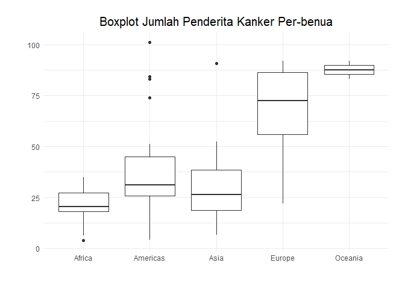
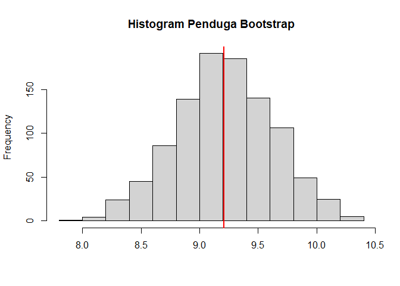
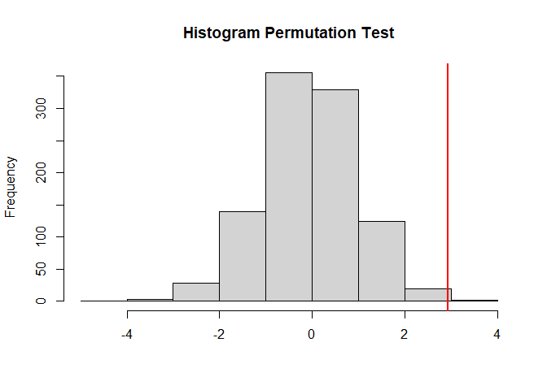

# Pembahasan UAS Tahun 2020/2021  

**Jawaban ini merupakan jawaban ketika UAS. Jika ada kesalahan silahkan
ajukan pull request**

## Load Library


``` r
library(dplyr)
library(ggplot2)
library(knitr)
library(gtools)
library(car)
```

## Nomor 1


Diberikan dataset (statistik\_kanker\_payudara.csv) yang
menginformasikan jumlah kasus kanker payudara (per 10.000 populasi) di
berbagai negara di belahan dunia beserta informasi mengenai beragam
faktor resiko gaya hidup dan kesehatan. Lakukan analisis yang tepat
untuk menjawab pertanyaan apakah jumlah kasus kanker signifikan berbeda
di benua yang berbeda? Lengkapi analisis Anda dengan menampilkan jumlah
dan distribusi kejadian kanker di setiap benua!

### Eksplorasi Data


#### Load Data

``` r
kanker <- read.csv("statistik_kanker_payudara.csv")
kanker %>%
      sample_n(10) %>%
      kable()
```

<table>
<colgroup>
<col style="width: 6%" />
<col style="width: 5%" />
<col style="width: 3%" />
<col style="width: 11%" />
<col style="width: 6%" />
<col style="width: 8%" />
<col style="width: 16%" />
<col style="width: 10%" />
<col style="width: 8%" />
<col style="width: 9%" />
<col style="width: 7%" />
<col style="width: 5%" />
</colgroup>
<thead>
<tr class="header">
<th style="text-align: left;">negara</th>
<th style="text-align: left;">benua</th>
<th style="text-align: right;">tahun</th>
<th style="text-align: right;">harapanLamaHidup</th>
<th style="text-align: right;">populasi</th>
<th style="text-align: right;">gdpPerCapita</th>
<th style="text-align: right;">jumlahKasusKankerPayudara</th>
<th style="text-align: right;">konsumsiAlkohol</th>
<th style="text-align: right;">tekananDarah</th>
<th style="text-align: right;">BodyMassIndex</th>
<th style="text-align: right;">kolesterol</th>
<th style="text-align: right;">merokok</th>
</tr>
</thead>
<tbody>
<tr class="odd">
<td style="text-align: left;">Romania</td>
<td style="text-align: left;">Europe</td>
<td style="text-align: right;">2002</td>
<td style="text-align: right;">71.322</td>
<td style="text-align: right;">22404337</td>
<td style="text-align: right;">7885.3601</td>
<td style="text-align: right;">44.3</td>
<td style="text-align: right;">15.30</td>
<td style="text-align: right;">129.3499</td>
<td style="text-align: right;">24.94229</td>
<td style="text-align: right;">4.968129</td>
<td style="text-align: right;">24.5</td>
</tr>
<tr class="even">
<td style="text-align: left;">Bolivia</td>
<td style="text-align: left;">Americas</td>
<td style="text-align: right;">2002</td>
<td style="text-align: right;">63.883</td>
<td style="text-align: right;">8445134</td>
<td style="text-align: right;">3413.2627</td>
<td style="text-align: right;">24.7</td>
<td style="text-align: right;">5.12</td>
<td style="text-align: right;">122.9154</td>
<td style="text-align: right;">26.13480</td>
<td style="text-align: right;">4.745852</td>
<td style="text-align: right;">29.2</td>
</tr>
<tr class="odd">
<td style="text-align: left;">Namibia</td>
<td style="text-align: left;">Africa</td>
<td style="text-align: right;">2002</td>
<td style="text-align: right;">51.479</td>
<td style="text-align: right;">1972153</td>
<td style="text-align: right;">4072.3248</td>
<td style="text-align: right;">24.7</td>
<td style="text-align: right;">9.62</td>
<td style="text-align: right;">132.2566</td>
<td style="text-align: right;">24.39392</td>
<td style="text-align: right;">4.592049</td>
<td style="text-align: right;">10.9</td>
</tr>
<tr class="even">
<td style="text-align: left;">Pakistan</td>
<td style="text-align: left;">Asia</td>
<td style="text-align: right;">2002</td>
<td style="text-align: right;">63.610</td>
<td style="text-align: right;">153403524</td>
<td style="text-align: right;">2092.7124</td>
<td style="text-align: right;">50.1</td>
<td style="text-align: right;">0.06</td>
<td style="text-align: right;">126.2059</td>
<td style="text-align: right;">23.07639</td>
<td style="text-align: right;">4.591925</td>
<td style="text-align: right;">6.6</td>
</tr>
<tr class="odd">
<td style="text-align: left;">Morocco</td>
<td style="text-align: left;">Africa</td>
<td style="text-align: right;">2002</td>
<td style="text-align: right;">69.615</td>
<td style="text-align: right;">31167783</td>
<td style="text-align: right;">3258.4956</td>
<td style="text-align: right;">22.5</td>
<td style="text-align: right;">1.46</td>
<td style="text-align: right;">126.6631</td>
<td style="text-align: right;">25.65263</td>
<td style="text-align: right;">4.749074</td>
<td style="text-align: right;">0.3</td>
</tr>
<tr class="even">
<td style="text-align: left;">Nigeria</td>
<td style="text-align: left;">Africa</td>
<td style="text-align: right;">2002</td>
<td style="text-align: right;">46.608</td>
<td style="text-align: right;">119901274</td>
<td style="text-align: right;">1615.2864</td>
<td style="text-align: right;">31.2</td>
<td style="text-align: right;">12.28</td>
<td style="text-align: right;">134.2376</td>
<td style="text-align: right;">23.24367</td>
<td style="text-align: right;">4.110205</td>
<td style="text-align: right;">1.2</td>
</tr>
<tr class="odd">
<td style="text-align: left;">Mauritius</td>
<td style="text-align: left;">Africa</td>
<td style="text-align: right;">2002</td>
<td style="text-align: right;">71.954</td>
<td style="text-align: right;">1200206</td>
<td style="text-align: right;">9021.8159</td>
<td style="text-align: right;">31.6</td>
<td style="text-align: right;">3.72</td>
<td style="text-align: right;">130.6751</td>
<td style="text-align: right;">25.57969</td>
<td style="text-align: right;">4.934729</td>
<td style="text-align: right;">1.1</td>
</tr>
<tr class="even">
<td style="text-align: left;">Mongolia</td>
<td style="text-align: left;">Asia</td>
<td style="text-align: right;">2002</td>
<td style="text-align: right;">65.033</td>
<td style="text-align: right;">2674234</td>
<td style="text-align: right;">2140.7393</td>
<td style="text-align: right;">6.6</td>
<td style="text-align: right;">3.24</td>
<td style="text-align: right;">128.8302</td>
<td style="text-align: right;">25.20751</td>
<td style="text-align: right;">4.831112</td>
<td style="text-align: right;">6.5</td>
</tr>
<tr class="odd">
<td style="text-align: left;">Jamaica</td>
<td style="text-align: left;">Americas</td>
<td style="text-align: right;">2002</td>
<td style="text-align: right;">72.047</td>
<td style="text-align: right;">2664659</td>
<td style="text-align: right;">6994.7749</td>
<td style="text-align: right;">43.5</td>
<td style="text-align: right;">5.00</td>
<td style="text-align: right;">124.9047</td>
<td style="text-align: right;">26.64816</td>
<td style="text-align: right;">4.742052</td>
<td style="text-align: right;">9.2</td>
</tr>
<tr class="even">
<td style="text-align: left;">Togo</td>
<td style="text-align: left;">Africa</td>
<td style="text-align: right;">2002</td>
<td style="text-align: right;">57.561</td>
<td style="text-align: right;">4977378</td>
<td style="text-align: right;">886.2206</td>
<td style="text-align: right;">28.1</td>
<td style="text-align: right;">1.99</td>
<td style="text-align: right;">129.8265</td>
<td style="text-align: right;">22.07173</td>
<td style="text-align: right;">4.169999</td>
<td style="text-align: right;">NA</td>
</tr>
</tbody>
</table>

#### Jumlah Kasus Kanker Per Benua

``` r
kanker %>%
      group_by(benua) %>%
      summarise(jumlah = sum(jumlahKasusKankerPayudara),
                jumlahNegara = n(),
                perNegara = jumlah/jumlahNegara) %>%
      arrange(desc(jumlah)) %>%
      kable()
```

| benua    |  jumlah|  jumlahNegara|  perNegara|
|:---------|-------:|-------------:|----------:|
| Europe   |  1786.2|            26|   68.70000|
| Africa   |   982.1|            46|   21.35000|
| Americas |   920.4|            23|   40.01739|
| Asia     |   802.3|            26|   30.85769|
| Oceania  |   175.1|             2|   87.55000|

Terlihat bahwa jumlah kasus payudara (tanpa melihat jumlah negara)
terbanyak ada di Eropa dengan jumlah 1786.2 per 10000 populasi kemudian
dilanjutkan dengan benua Afrika, Amerika, Asia dan yang terkecil adalah
benua Ocenia hanya sebanyak 175.1 oer 10000 populasi.

Akan tetapi jika jumlah kasus dibagi per jumlah negara dibenua tersebut
diperoleh bahwa yang terbanyak adalah benua Ocenia sebanyak 68.7 per
10000 populasi, dilanjut Eropa, Amerika, Asia dan yang terakhir adalah
benua Afrika. Hal ini semakin jelas ketika kita membuat visualisasi dari
datanya

#### Visualisasi Persebarannya

``` r
kanker %>%
      ggplot(aes(x = benua, y = jumlahKasusKankerPayudara)) +
      geom_boxplot() +
      theme_minimal() +
      labs(title =  "Boxplot Jumlah Penderita Kanker Per-benua",
           x = "",
           y = "") +
      theme(plot.title = element_text(hjust = 0.5, size = 15),
            plot.margin = margin(20, 20, 20, 20))
```



Untuk menjawab pertanyaan apakah jumlah kasus kanker signifikan berbeda
di benua yang berbeda? Akan digunakan uji Anova Satu Arah. Sebelum itu
akan diuji asumsi terlebih dahulu

Uji Asumsi Anova
----------------

#### Uji Kesamaan Varians

-   *H*<sub>0</sub> : Memiliki varians yang sama
-   *H*<sub>1</sub> : Memiliki varians yang berbeda

``` r
leveneTest(log(jumlahKasusKankerPayudara) ~ factor(benua), data = kanker)
```

    ## Levene's Test for Homogeneity of Variance (center = median)
    ##        Df F value Pr(>F)
    ## group   4  1.9401 0.1083
    ##       118

Yang akan diuji adalah log dari jumlah kasusnya. Diperoleh bahwa p-value
sebesar 0.10 yang berarti dengan alpa 5% kita gagal tolak
*H*<sub>0</sub>, maka dengan tingkat signifikansi 5% diperoleh cukup
bukti bahwa semuanya memiliki varian yang sama.

#### Uji Asumsi Normalitas

``` r
hasilSplit <- split(kanker$jumlahKasusKankerPayudara, kanker$benua)
lapply(hasilSplit[1:4], shapiro.test)
```

    ## $Africa
    ## 
    ##  Shapiro-Wilk normality test
    ## 
    ## data:  X[[i]]
    ## W = 0.97781, p-value = 0.5192
    ## 
    ## 
    ## $Americas
    ## 
    ##  Shapiro-Wilk normality test
    ## 
    ## data:  X[[i]]
    ## W = 0.8566, p-value = 0.003591
    ## 
    ## 
    ## $Asia
    ## 
    ##  Shapiro-Wilk normality test
    ## 
    ## data:  X[[i]]
    ## W = 0.86184, p-value = 0.002435
    ## 
    ## 
    ## $Europe
    ## 
    ##  Shapiro-Wilk normality test
    ## 
    ## data:  X[[i]]
    ## W = 0.92998, p-value = 0.07741

Terlihat tidak semua benua berdistribusi normal. Yang normal hanya benua
Eropa dan Afrika. Selain itu benua Ocenia tidak dapat dilakukan tes
kenormalah karena hanya memiliki dua data

Data beberapa hal diatas diperoleh bahwa asumsi kesamaan varians
terpenuhi akan tetapi asumsi normalitas tidak terpenuhi. Oleh karena itu
ada dua pilihan

1.  Tetap memaksakan menggunakan Anova tetapi asumsi kenormalan
    terlanggar, yang akan berakibat hasil yang duperoleh tidak akan baik
2.  Menggunakan uji nonparametrik yaitu Uji Kruskal Wallis

### Uji Anova (Parametrik)


-   *H*<sub>0</sub> : Rata-rata jumlah kasus disetiap benua sama
-   *H*<sub>1</sub> : Minimal ada satu rata-rata yang berbeda

``` r
res.aov <- aov(log(jumlahKasusKankerPayudara) ~ benua, data = kanker)
summary(res.aov)
```

    ##              Df Sum Sq Mean Sq F value Pr(>F)    
    ## benua         4  26.63   6.657   28.52 <2e-16 ***
    ## Residuals   118  27.54   0.233                   
    ## ---
    ## Signif. codes:  0 '***' 0.001 '**' 0.01 '*' 0.05 '.' 0.1 ' ' 1

Diperoleh p-value yang sangat kecil, oleh karena itu dengan alpa 5% kita
dapat menolak H0, maka dengan tingkat signifikansi 5% diperoleh cukup
bukti bahwa minimal ada satu benua yang memiliki jumlah kasus berbeda
secara signifikan. Untuk melihat yang mana berbeda akan digunakan uji
perbadingan ganda dengan Uji Tukey

#### Uji Tukey

-   *H*<sub>0</sub> : Rata-rata keduanya sama
-   *H*<sub>1</sub> : Rata-rata keduanya berbeda

``` r
TukeyHSD(res.aov)
```

    ##   Tukey multiple comparisons of means
    ##     95% family-wise confidence level
    ## 
    ## Fit: aov(formula = log(jumlahKasusKankerPayudara) ~ benua, data = kanker)
    ## 
    ## $benua
    ##                        diff         lwr       upr     p adj
    ## Americas-Africa   0.5229617  0.18114027 0.8647832 0.0004259
    ## Asia-Africa       0.3026285 -0.02578293 0.6310399 0.0861080
    ## Europe-Africa     1.1971142  0.86870273 1.5255256 0.0000000
    ## Oceania-Africa    1.4816499  0.51483283 2.4484670 0.0004145
    ## Asia-Americas    -0.2203332 -0.60347991 0.1628134 0.5047390
    ## Europe-Americas   0.6741524  0.29100576 1.0572991 0.0000335
    ## Oceania-Americas  0.9586882 -0.02806538 1.9454418 0.0612221
    ## Europe-Asia       0.8944857  0.52325321 1.2657181 0.0000000
    ## Oceania-Asia      1.1790214  0.19683266 2.1612102 0.0101602
    ## Oceania-Europe    0.2845358 -0.69765301 1.2667245 0.9293492

Dari hasil diatas diperoleh hanya 3 pasang yang memiliki p-value lebih
dari 0.05, yaitu Asia-Africa, Asia-Americas, Oceania-Europe. Hal ini
menunjukkan bahwa jumlah kasus kanker antara Asia dan Afrika berbeda
secara signifikan, benua Asia dan Amerika juga berbeda secara
signifikan, begitu juga dengan benua Ocenia dan Eropa.

### Uji Kruskal Wallis (Non-parametrik)


-   *H*<sub>0</sub> : Semuanya memiliki median yang sama
-   *H*<sub>1</sub> : Minimal ada satu median yang berbeda

``` r
kruskal.test(jumlahKasusKankerPayudara ~ benua, data = kanker)
```

    ## 
    ##  Kruskal-Wallis rank sum test
    ## 
    ## data:  jumlahKasusKankerPayudara by benua
    ## Kruskal-Wallis chi-squared = 63.242, df = 4, p-value = 6.034e-13

Dari hasil atas diperoleh hal yang sama dengan Anova yaitu tolak
*H*<sub>0</sub>, yang berarti diperoleh cukup bukti bahwa minimal ada
satu benua yang memiliki jumlah kasus berbeda secara signifikan.

#### Uji Perbandingan Ganda

``` r
pairwise.wilcox.test(kanker$jumlahKasusKankerPayudara, kanker$benua, p.adjust.method = "BH")
```

    ## 
    ##  Pairwise comparisons using Wilcoxon rank sum test with continuity correction 
    ## 
    ## data:  kanker$jumlahKasusKankerPayudara and kanker$benua 
    ## 
    ##          Africa  Americas Asia    Europe 
    ## Americas 4.5e-05 -        -       -      
    ## Asia     0.03526 0.15339  -       -      
    ## Europe   1.5e-10 0.00014  7.9e-07 -      
    ## Oceania  0.03526 0.06343  0.04118 0.15339
    ## 
    ## P value adjustment method: BH

Dengan alpa 5% dan dari hasi diatas diperoleh beberapa 3 pasang benua
yang memiliki jumlah kasus kanker payudara berbeda secara signifikan
yaitu Asia-Amerika, Ocenia-Amerika, dan Ocenia-Eropa. Yang mana hasil
ini berbeda satu pasang dengan hasil uji Tukey, yaitu pada uji Tukey
yang berbeda adalah Asia-Afrika, tetapi di uji pairwise wwilcoxon tidak
berbeda, sementara pada wilcoxon yang berebda ada Ocenia-Amerika, tetapi
tidak diuji Tukey

## Nomor 2


Pada tahun 2019, diambilah 33 mahasiswa Polstat STIS untuk diteliti
nilai matakuliah Komputasi Statistik nya. Diperoleh nilai matakuliah
Komputasi Statistik sebagai berikut: 84, 93, 101, 86, 82, 86, 88, 94,
89, 94, 93, 83, 95, 86, 94, 87, 91, 96, 89, 79, 99, 98, 81, 80, 88, 100,
90, 100, 81, 98, 87, 95, and 94. Populasi dari nilai matakuliah tersebut
diyakini berdistribusi normal dengan simpangan baku sebesar 6,8. Lakukan
estimasi rata-rata nilai matakuliah pada populasi dengan selang
kepercayaan 95% dan interpretasikan hasilnya!

### Memasukkan Data


Dari soal diketahui bahwa data berdistribusi normal, tidak terbatas dan
varian diketahui

``` r
sd <- 6.8
alpa <- 0.05
data <- c(84, 93, 101, 86, 82, 86, 88, 94, 89, 94, 93, 83, 95, 86, 94, 87, 91, 96, 89, 79, 99, 98, 81, 80, 88, 100, 90, 100, 81, 98, 87, 95, 94)
data
```

    ##  [1]  84  93 101  86  82  86  88  94  89  94  93  83  95  86  94  87  91  96  89
    ## [20]  79  99  98  81  80  88 100  90 100  81  98  87  95  94

### Membuat Fungsi Sendiri


``` r
ci <- function(x, var, alpa = 0.05){
      rata2 <- mean(x)
      n <- length(x)
      zhitung <- qnorm(alpa/2,  lower.tail = FALSE)
      se <- sqrt(var/n)
      
      ci <- rata2 + (c(-1, 1) * zhitung * se)
      list(ci = paste(round(ci, 3) ,collapse=" - "),
           batas_atas = ci[2],
           batas_bawah = ci[1],
           mean = rata2,
           se = se,
           alpa = alpa,
           n = n,
           var = var)
}
```

### Mencari Confident Interval


``` r
result <- ci(data, sd^2, alpa = alpa)
kable(data.frame(result))
```

| ci              |  batas\_atas|  batas\_bawah|      mean|        se|  alpa|    n|    var|
|:----------------|------------:|-------------:|---------:|---------:|-----:|----:|------:|
| 88.013 - 92.653 |      92.6534|      88.01327|  90.33333|  1.183728|  0.05|   33|  46.24|

Dari hasil diatas diperoleh bahwa rata-rata nilai komputasi statistik
dari 33 mahasiswa Polstat STIS sebesar 90.33

Dengan tingkat kepercayaan 95% rata-rata nilai komputasi statistik dari
mahasiswa Polstat STIS berada pada interval 88.01327 dan 92.653 dengan
standard error sebesar 1.183728

## Nomor 3


Diberikan dataset (tv.csv) dari beberapa sampel yang menjelaskan durasi
(dalam menit) tayangan iklan per setengah jam antara dua kelompok TV
yaitu kelompok Basic dan Extended (extra cost). Dari sampel tersebut
kita bisa mengestimasi rata-rata durasi seluruh tayangan iklan
(populasi) di masing-masing TV dan mengestimasi perbedaaan tayangan
iklan di TV Basic dengan di TV Extended. Namun hasil estimasi bergantung
dari sampel yang diambil, jika sampel yang diambil berbeda maka hasil
estimasipun bisa berbeda.

1.  Lakukan teknik bootstrap pada data TV Basic dengan resample sebanyak
    1000 kali.
    -   Hitunglah rata-rata durasi tayangan iklan pada TV Basic untuk
        masing-masing resample
    -   Gambarlah distribusi bootstrap
    -   Hitung standar error dari bootstrap
2.  Lakukan permutation test dengan resample sebanyak 1000 kali untuk
    menguji apakah terdapat perbedaan rata-rata durasi tayangan iklan
    antara TV Basic dan TV Extended.
    -   Tuliskan hipotesis null dan hipotesis alternatifnya
    -   Interpretasikan hasilnya (boleh menggunakan visualisasi)

### Load Data


``` r
tv <- read.csv("tv.csv")
kable(head(tv))
```

|   id|  Time| Cable |
|----:|-----:|:------|
|    1|   7.0| Basic |
|    2|  10.0| Basic |
|    3|  10.6| Basic |
|    4|  10.2| Basic |
|    5|   8.6| Basic |
|    6|   7.6| Basic |

### Bagian A


#### Filter Data TV Basic

``` r
basic <- tv %>%
            filter(Cable == "Basic") %>%
            pull(Time)
basic
```

    ##  [1]  7.0 10.0 10.6 10.2  8.6  7.6  8.2 10.4 11.0  8.5

#### Iterasi Bootstrap

Akan digunakan `set.seed` akan memiliki hasil yang selalu sama jika
program dijalankan

``` r
boot <- NULL
iter <- 1000
set.seed(2723)
for(i in 1:iter){
      boot_sample <- sample(basic, replace = TRUE)
      boot[i] <- mean(boot_sample)
}
mean(boot)
```

    ## [1] 9.2155

Dari hasil perhitungan tiap resampling diperoleh penduga rata-rata
bootstrap untuk durasi tayangan iklan pada TV Basic sebesar 9.2155 menit

##### Menghitung Bias

``` r
mean(boot) - mean(basic)
```

    ## [1] 0.0055

Bias dari penduga bootstrap dengan penduga sampel sebenarnya sebesar
0.0055

##### Menghitung CI 95%

Untuk menghitung CI digunakan metode percentile

``` r
quantile(boot, probs = c(0.05, 0.95))
```

    ##   5%  95% 
    ## 8.48 9.90

Diperoleh bahwa CI 95% dari penduga bootstrap adalah berada pada
interval 8.48 sampai 9.90

#### Membuat Visualisasi

``` r
hist(boot, xlab = "", main = "Histogram Penduga Bootstrap")
abline(v = mean(basic), col = "red", lwd=2)
```



Garis mereah merupakan rata-rata sebenarnya dari sampel yang ada,
terlihat bahwa distribusi bootstrap sudah normal dan nilai meannya
sangat mendekati dengan mean rata-rata sampel sesungguhnya.

#### Menghitung Standard Error

Standard Error dari penduga bootstrap adalah standard deviasi dari
penduga bootstrap

``` r
sd(boot)
```

    ## [1] 0.4172165

Jadi standar error dari penduga bootstrap sebesar 0.4172165

### Bagian B


#### Ambil Data dan Uji Kesamaan Varians

``` r
extend <- tv %>%
            filter(Cable == "Extended") %>%
            pull(Time)
extend
```

    ##  [1] 3.4 7.8 9.4 4.7 5.4 7.6 5.0 8.0 7.8 9.6

-   H0 : Varians Keduanya sama
-   H1 : Varians keduanya berbeda

``` r
var.test(basic, extend)
```

    ## 
    ##  F test to compare two variances
    ## 
    ## data:  basic and extend
    ## F = 0.44042, num df = 9, denom df = 9, p-value = 0.2377
    ## alternative hypothesis: true ratio of variances is not equal to 1
    ## 95 percent confidence interval:
    ##  0.1093931 1.7731125
    ## sample estimates:
    ## ratio of variances 
    ##          0.4404161

Diperoleh p-value 0.2377, dengan alpa 5% gagal tolak *H*<sub>0</sub>,
yang berarti diperoleh cukup bukti bahwa varians rata-rata durasi
tayangan iklan antara TV Basic dan TV sama

#### Hipotesis

-   *H*<sub>0</sub> : Tidak terdapat perbedaan rata-rata durasi tayangan
    iklan antara TV Basic dan TV Extended
-   *H*<sub>1</sub> :Terdapat perbedaan rata-rata durasi tayangan iklan
    antara TV Basic dan TV Extended

#### Initial Test

``` r
t_init <- t.test(basic, extend, var.equal = TRUE)
t_init
```

    ## 
    ##  Two Sample t-test
    ## 
    ## data:  basic and extend
    ## t = 2.9319, df = 18, p-value = 0.00891
    ## alternative hypothesis: true difference in means is not equal to 0
    ## 95 percent confidence interval:
    ##  0.6632062 4.0167938
    ## sample estimates:
    ## mean of x mean of y 
    ##      9.21      6.87

Diperoleh p-value yang sangat kecil oleh karena tolak H0 yang berarti
rata-rata keduanya berbeda.

#### Permutation Test

``` r
iter <- 1000
permut <- NULL
set.seed(270100)
for (i in 1:iter){
      my_sample <- tv %>%
            mutate(newValue = sample(c(basic, extend), replace = FALSE))
      permut[i] <- t.test(newValue ~ Cable, data = my_sample, var.equal = TRUE)$statistic
}
mean(permut > t_init$statistic)
```

    ## [1] 0.003

**Visualisasi**

``` r
hist(permut, xlab = "", main = "Histogram Permutation Test")
abline(v = t_init$statistic, col = "red", lwd=2)
```



Dari hasil diatas diperoleh bahwa p-value dari permutation test sekitar
0.005 yang mana hampir sama dengan p-value dari t test sebenarnya
(0.008). Dari gambar juga terlihat semakin jelas, garis berwarna merah
adalah nilai statistik dari t test sebenarnya

Oleh karena itu dapat disimpulakan dengan permutation test bahwa dengan
alpa 5% kita cukup yakin untuk menolak *H*<sub>0</sub>, sehingga
diperoleh cukup bukti bahwa terdapat perbedaan rata-rata durasi tayangan
iklan antara TV Basic dan TV Extended
